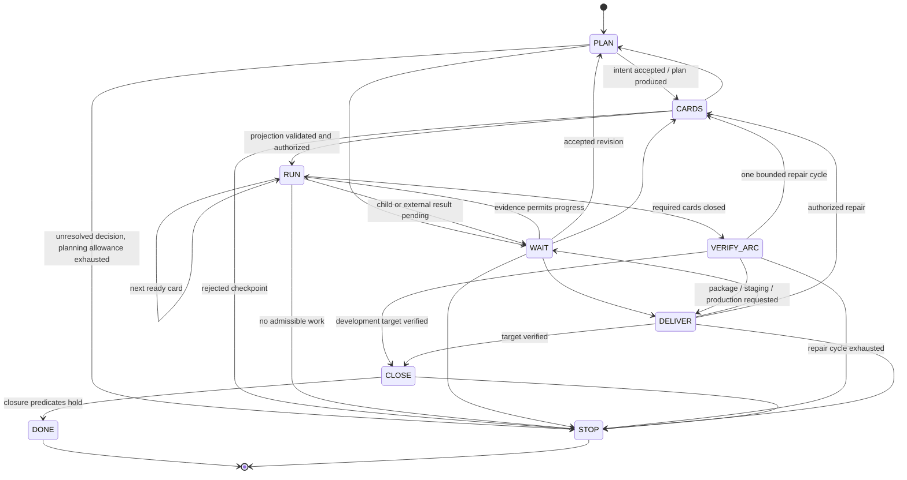
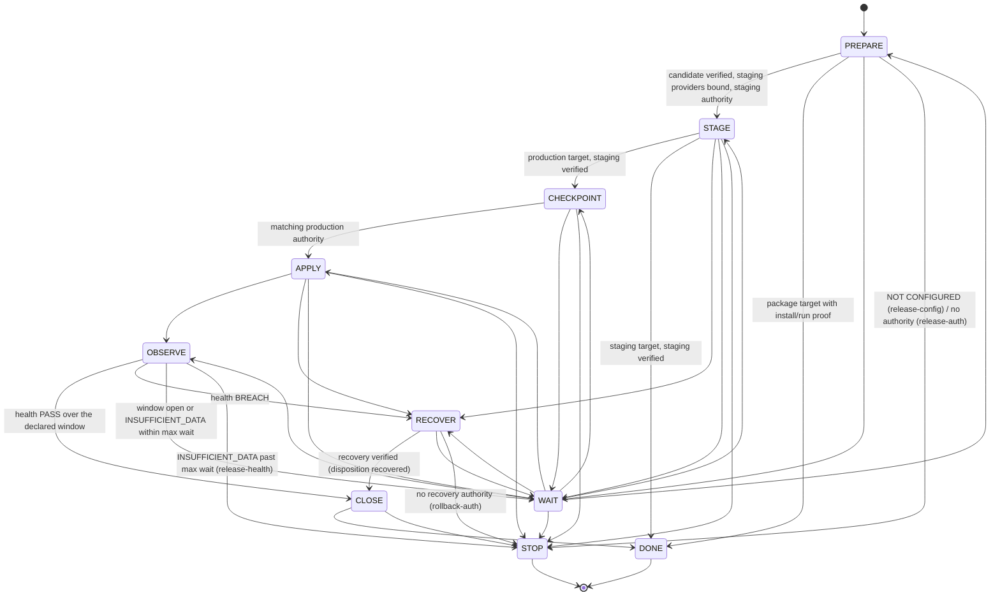

# Architecture

aidlc is a library plus CLI. The library holds pure decision engines (state machines and
policies over persisted facts), a small durable state layer, coordination primitives for
multiple sessions, probes and adapters for real project tools, and the artifact chain of the
Anthropic playbook. The CLI exposes one typed directive per call and commits results.

## Module map

`src/core/` holds the decision engines. `types.ts` defines every persisted record as a zod schema (Goal, CardRun, ReleaseAttempt, JournalEvent, Lease, ReviewRequest, OperationRecord, AuthorizationRecord, EffortEpisode) plus the constants for limits. `router.ts` classifies a request into size, kind, delivery target and modules. `deadlines.ts` computes goal/card admission deadlines and the reconciliation grace. `effort.ts` bounds implementation attempts (MA2). `review-policy.ts` parses scaffold verdicts, classifies them, keeps the two-decision ledger and the finding bookkeeping (ids, `re:F<n>` re-raises, dispositions, the same-candidate rule, deadlocks). `ci-policy.ts` classifies CI failures and allows one persisted transient rerun. `health.ts` evaluates PASS/BREACH/INSUFFICIENT_DATA. `authorization.ts` binds approvals to candidate, environment and effects. `arc.ts` picks the next wave of cards; a `depends_on` id outside the goal's projection is satisfied only by the outcome the caller vouches for, which `GoalController.cardOutcomes` derives from the card registry's merged status (the rule `computeRevision` applies when it admits such a projection), and is itself never ordered, dispatched or reported. `goal-machine.ts`, `card-machine.ts` and `release-machine.ts` are the three state machines. `migrate.ts` detects data impact and builds the expand/deploy/backfill/verify/contract graph. `amendments.ts` routes live requirement changes. `roles.ts` resolves model/effort profiles per role.

`src/state/` is persistence. `paths.ts` resolves the canonical state directory (`<git common dir>/../.aidlc`, override `AIDLC_STATE_DIR`). `goal-store.ts` serializes every card-run write through an exclusive lock file with an ownership-checked write and release (`updateCardRun`: the deadline is checked before every retry acquisition, a stale lock is taken over only when its owner process is gone, a stat or read failure other than a vanished file propagates; `saveCardRun` is a compare-and-set on `CardRun.revision`, bumped by every write under the lock, so a snapshot read before another write landed is refused whatever it changes, with the ledger entry named when one is missing, un-decided, resurrected or regressed; findings are merged by revision); `store.ts` writes JSON atomically (temp file + rename, exclusive create for claims, interrupted-write detection). `journal.ts` is the append-only hash-chained event log and the process actor identity; the session id comes from `AIDLC_SESSION`, then the Claude Code session (`CLAUDE_CODE_SESSION_ID`, exported to Claude Code's subprocesses; the older `CLAUDE_SESSION_ID` is still read), then a per-repository default token in `.aidlc/session-default` (single-controller interim mode); a hook process takes it from the hook event's `session_id` (`hooks/index.ts`). An identity change rewrites no lease record: a lease claimed under the default token by an earlier version, or by a Claude Code session that has ended (a `/clear` starts a new one), stays as recorded and expires after its TTL; `aidlc goal takeover` then takes the goal lease after the old owner's operations are reconciled. A card lease held by an ended session is continued while it is live by a process running with `AIDLC_SESSION` set to the owner session id, which `aidlc card status` prints from the lease record, provided the run's `ownerGeneration` equals the lease generation (the renewal in `loop/card-runner.ts` requires it; a run interrupted between the lease claim and the PREPARE save has none), since a run stopped for ownership before PREPARE carries the generic stale-generation detail. Once it has expired, `aidlc card takeover` (`CardRunner.takeover`) takes it after the card's operations in every goal are reconciled, validated on the record the store hands to the reconciliation: the generation advances and the old owner is fenced, the run, read again once the lease is held, records the new generation (the run without one included) and its state is selected again through the evidence gathering `next` shares with it, which reads the stored run and never a caller's snapshot (a stale dispatch writes nothing back and a persisted blocking stop stands), and whose renewal revalidates the ownership stop; a missing or released lease, a lease this session holds at the run's generation, a live lease of another session and an unresolved operation refuse it before any write; an operation admitted between the reconciliation's read and the lease write leaves the lease taken and the run untouched until it is reconciled; a handoff intent (`NOTE`, `card-takeover-intent`) precedes the lease write and one `LEASE_ACQUIRED` per generation follows it, both resolved by resource and generation across every goal's journal, so a lease this session holds at a generation the run does not carry is an interrupted takeover the command completes after reading the lease once more, naming the previous owner from the intent. `next` reads the stored run before its plan-checkpoint guard as well, and lifts an ownership stop whose lease is absent or released (never one merely expired) so the claim is reachable; `recordAttempt` saves onto the stored run too but applies no fence; the handoff intent is bound to the acquiring session and the acquisition time the lease carries, and an acquisition PREPARE journaled counts as the one. The guarantees end at the store's missing compare-and-set; `docs/OPERATIONS.md` (Sessions) names the four windows that remain (the lease write, the run write, the journal, the ledger) and the recovery for each, and nothing serialises the takeover with claim, renewal and release. `goal-store.ts` persists goals, card runs and release attempts. `board.ts` renders the Markdown board, which is a view, never a store; its Arc line reports the arc the controller decided, so the caller hands it the outcomes it resolved (`prerequisitesClosedElsewhere`) and `aidlc board` prints the one text it writes rather than a second render of its own.

`src/coordination/` is package S of the plan. `lease.ts` provides atomic claims with generations, heartbeat, release, takeover-after-reconciliation (exposed as `aidlc goal takeover` and `aidlc card takeover`) and fencing. `review-queue.ts` is the shared provider/account admission queue. `reconcile.ts` is the operation ledger: intent before issue, reconciliation by provider lookup, explicit UNKNOWN.

`src/probes/` gathers evidence. `exec.ts` runs commands and returns receipts (exit, output digest, timing) with a scripted runner for tests. `git.ts` reads worktrees, HEAD, status, base resolution, divergence and containment. `gh.ts` resolves PR identity, run views and check runs with pagination.

`src/delivery/` touches the project. `worktree.ts` decides start vs attach vs stop from branch, path, common directory and owner record. `ship.ts` defines the ship path interface, classifies `task.ps1` sentinels for the scaffold adapter and provides a dry-run path. `ops.ts` loads `aidlc.ops.json` (operation roles, bindings, environments, health signals) and executes or looks up bound operations.

`src/artifacts/` is the playbook artifact chain. `frontmatter.ts` parses the scaffold's front matter conventions. `card.ts` parses, validates and renders task cards and computes the tier. `intent.ts`, `spec.ts` (EARS classification) and `plan.ts` (definition-of-ready gates, task-split parsing) cover stages 1-3.

`src/providers/` abstracts model calls: `types.ts` (interface, invocation ids, JSON extraction), `mock.ts`, `claude-api.ts` (Anthropic SDK, adaptive thinking, effort mapping, quota/refusal outcomes), `claude-code.ts` (`claude -p --output-format json`).

`src/maintain/` closes the loop: `bands.ts` (rolling baseline, Western Electric rules, tiers from `bands.yaml`), `incident.ts` (deduplicated incident ledger and intent.md writer).

`src/evals/runner.ts` loads `evals/*.json`, runs an optional model step and deterministic checks, and gates on a pass rate.

`src/audit/` provides the evidence manifest with sealing (`manifest.ts`) and the independent verifier (`verifier.ts`).

`src/hooks/index.ts` implements the six Claude Code guards; `src/hooks/entry.ts` runs every guard that applies to an event in one process (`bin/aidlc-hook.js`, `aidlc hook auto`), so a tool call costs one node start. `src/review/pre-review.ts` builds the pre-review (R2) prompt (the policy hash, sha256 of the applied REVIEW.md text, in its policy heading with the rule files the candidate changes; the delta since the last reviewed candidate on later rounds; the pre-review's advisory notes on the formal stage; a diff above the stage's byte cap is refused before dispatch, never cut), runs the configured second-model reviewer with a receipt and extracts the verdict (a reason tagged `[question]` or `[suggestion]` is advisory; a new finding outside the delta is a first-round miss, `outsideDelta`); the card runner gates SHIP on a fresh pass per candidate and per R3 cycle; with `formalReview.command` set the same module runs R3 (Codex here) and feeds the existing review ledger, so a block is REVIEW_FIX and the repaired candidate restarts the pre-review cycle. Both prompts carry the repository's learned invariants after the policy section: `reviewLessons` (`src/artifacts/lessons.ts`) reads the NEVER and ALWAYS lines of `docs/LESSONS.md` newest first under `REVIEW_LESSONS_MAX_BYTES` and returns them with the count the cap left out, and the card runner reads them with the other prompt inputs of each dispatch. `src/review/stats.ts` summarises both ledgers over the persisted card runs: rounds, decisions, blocks, durations, findings by disposition, re-raises and first-round misses per card, and the totals of a family of superseded cards (`aidlc review stats`). `src/loop/` contains the directive contract, the goal controller, the card runner and the release runner. `src/scaffold/init.ts` copies `templates/` over a repository. `src/cli/main.ts` wires everything with commander.

## Goal state machine

A recorded deadline extension re-admits a goal stopped for time (re-entering through `CARDS`) and the time-stopped card runs of its current projection (stops cleared, runs in progress again, card deadlines moved to the new goal deadline, journaled as `GOAL_STATE` and `CARD_STATE`; a superseded card keeps its stop); a resume carrying a revision applies it before the projection (re-entering through `CARDS`, the completion evidence of the old projection reset to pending), so replacement cards run in the resumed generation; delivery evidence is bound to the generation, so no earlier release is reused. While a T2 goal is in `CARDS` without the plan checkpoint for its current revision, `card next` parks its cards (`wait`) until the approval is recorded. A goal parked in `WAIT` (polled while its cards were still running) resumes to `RUN`, journaled as `GOAL_STATE WAIT->RUN`, before `VERIFY_ARC` is derived once every required card is closed; the diagram has no `WAIT -> VERIFY_ARC` edge.

Source: `GOAL_TRANSITIONS` and guards in `src/core/goal-machine.ts`.

Guards: `CARDS` from `PLAN` needs accepted intent; `RUN` needs an authorized projection (T2: a `plan-checkpoint` authorization for the current revision); `VERIFY_ARC` needs all required cards closed (an empty ready set with gaps is WAIT or STOP, never DONE); `DELIVER` is refused for a development-only goal; a non-development target must pass `DELIVER` before `CLOSE`; `DONE` needs complete closure; terminal goals refuse every transition until `resume` links a new generation.

## Release state machine

Source: `RELEASE_TRANSITIONS` and guards in `src/core/release-machine.ts`.

`finalStateForTarget` fixes where each target ends: package after PREPARE, staging after STAGE, production and migration after OBSERVE. A recovered attempt closes with disposition `recovered`, never `delivered`.

## Card state precedence

`selectCardState` in `src/core/card-machine.ts` evaluates evidence in this order and returns the first match:

1. Unknown operations exist: WAIT (no new mutation), or STOP/time once the reconciliation grace has expired.
2. A terminal record, a stale ownership generation (STOP/ownership) or a capability blocker (STOP/capability).
3. Merge verified and closure complete: DONE.
4. A known operation still running: WAIT.
5. Merge verified, closure incomplete: CLOSE. The closure predicates are metadata, docSync, findings, evidence, cleanup and lessons; the last needs a lesson line appended to `docs/LESSONS.md` (frozen format owned by `src/artifacts/lessons.ts`; every write is an append, the header and the first line going out in one exclusive append, so no writer overwrites another and existing bytes are never rewritten; a retry reuses the line journaled as pending, so a completed append is recognised even after a date rollover) or a recorded reason to skip, both journaled as EVIDENCE_RETAINED (a lesson as pending before the file changes and as recorded after), and `card close --all` never asserts it. Closure flags are accepted for a CLOSE run of a live goal only (the persisted goal decides, read again right before any write), with a verified merge and a present card lease that is fenced like every other mutation; the lease is the serialisation of a card's closers, every lessons write is an append and a retry reuses the pending line, so no line is written twice. CLOSE reads the stored run (a stale `card next` never undoes a recorded disposition), renews the card lease for its owner and lets a replacement session take over an expired one once no delivery operation is unresolved; an ownership stop of a merged card is reconciled once the blocking lease is gone. The raw card patch sets neither closure predicates, merge evidence, lease generations nor a CLOSE or DONE state, and a run persisted as DONE before the predicate existed stays DONE at card and goal level. PREPARE hands the card the same file with its count and most recent lines.
6. Admission deadline reached: STOP/time.
7. Review allowance exhausted (STOP/review) or repair episode exhausted (STOP/card).
8. No validated run context: PREPARE.
9. Fresh substantive block with allowance left: REVIEW_FIX.
10. Acceptance work incomplete (no RED/DoD receipt, dirty candidate, code-caused CI failure): BUILD.
11. Candidate ready, no active operation, merge incomplete: SHIP.

## Directive contract

`src/loop/directive.ts`. Every directive carries `goalId`, `generation`, `revision`, `goalState`, `deadline`, a `narration` and `skills` (the companion skills the step calls for, from the goal routing: `tdd`, `diagnose`, `grilling`, `merge-conflicts`; advisory names, never a gate). Kinds:

| Kind | Payload | Meaning |
|---|---|---|
| `ask` | question, options, responseRoute | one sizing/identity question the context cannot resolve |
| `plan` | size, inputs, invocationAllowance, outputs | produce the plan at the routed depth |
| `project-cards` | planRef, cardsDir, outputs | write/validate cards; human sign-off owns the registry |
| `checkpoint` | approvalKind, packet, responseRoute | T2 plan+projection approval, or a production approval packet |
| `run-card` | cardId, cardState, worktree, base, mode, effort, role, cardDeadline, context | run one card through `aidlc card next` |
| `verify-arc` | cards, integratedChecks, repairCyclesLeft | verify the whole goal on the integrated artifact |
| `release` | attemptId, releaseState, target, environment, packet | drive the release attempt |
| `wait` | on, until, pollSeconds | attach to one known signal |
| `close` | missing | perform only the missing closure steps |
| `done` | evidence | return the existing result |
| `stop` | stop record (reason, detail, nextAction, global, unresolved operations) | preserved partial effects and the precise next action |

`ReportResult` values accepted by `aidlc report --result`: `intent-accepted`, `plan-produced`, `plan-failed`, `cards-projected`, `approved`, `rejected`, `card-result`, `arc-verified`, `arc-failed`, `release-result`, `revision`, `cancel`, `resume`. A report carrying a stale `generation` is refused.

## Persisted state

Everything lives under `<main checkout>/.aidlc/` (gitignored, shared by all linked worktrees):

| Path | Content | Owner |
|---|---|---|
| `goals/<goalId>.json` | Goal record: revisions, routing, stages, deadlines, authorizations, cards, counters, role profiles, stop | `state/goal-store.ts`, written by `loop/controller.ts` |
| `cards/<goalId>/<cardId>.json` | CardRun: state, start/deadline, owner generation, worktree, candidate, PR, review and CI ledgers (pending R2 rounds, residual hand-offs, the policy hash and the advisory notes per round, the policy hash per decision), findings (ids, dispositions, re-raises, revisions) and their first-round misses (`outsideDelta`), the DoD receipt a block cleared, effort episode, receipts, closure flags, the run revision (compare-and-set for snapshot writes); written under `<file>.lock` | `loop/card-runner.ts` |
| `journal/<goalId>.jsonl`, `journal/_host.jsonl` | hash-chained events (seq, ts, type, actor, data, prevHash, hash) | `state/journal.ts` |
| `leases/<hash>.json` | one lease per resource key (goal, card, integration, environment, database, review pool) | `coordination/lease.ts` |
| `review-queue/<hash>.json`, `review-queue/_pool-<hash>.json` | review requests and pool state (active slots, resetAt, notification owner, next seq) | `coordination/review-queue.ts` |
| `operations/<opId>.json` | OperationRecord: intent, issue, provider id, status incl. UNKNOWN, reconciliation | `coordination/reconcile.ts` |
| `evidence/<goalId>/manifest.json` + artifacts | retained artifacts with sha256, models, host, seal | `audit/manifest.ts` |
| `board/<goalId>.md` (mirrored to `_local/aidlc-board.md`) | regenerated view | `state/board.ts` |
| `releases/<attemptId>.json` | ReleaseAttempt: target, environment, candidate, steps, operations, health window/result, disposition | `loop/release-runner.ts` |
| `incidents/incidents.json` | breach identity ledger with disposition | `maintain/incident.ts` |
| `fix-task` | active fix-task marker read by the protect-tests hook | `loop/card-runner.ts`, CLI `card fix-task` |
| `session-default` | default session token shared by processes that set no `AIDLC_SESSION` and run outside Claude Code (no `CLAUDE_CODE_SESSION_ID`) | `state/journal.ts` |

## Evidence and audit chain

1. Every controller, card runner and release runner action appends a `JournalEvent`; each event hashes its canonical JSON plus the previous hash. `Journal.verify()` detects malformed lines, sequence gaps, prev-hash mismatches and altered events.
2. `EvidenceStore.retain` copies artifacts into `evidence/<goalId>/` and records sha256, size, candidate digest, environment and invocation id. `seal` binds the manifest to the journal head hash, event count, final SHA/digest, models and host, and computes a digest over the canonical manifest.
3. `verifyAudit` reports a level: `none` (no events), `recorded` (events exist), `traceable` (chain intact, every operation intent has a result or explicit UNKNOWN, delegated work carries invocation ids, no work after a terminal event), `independently-verified` (additionally the seal verifies, artifacts match their digests and evidence is bound to the final candidate). Non-mutating events after the seal (closure bookkeeping) are a `MANIFEST_TRAILING` warning; a mutation after the seal makes it `MANIFEST_STALE`. A "fully audited" claim is `verified` only at that level with a host capture boundary asserted; otherwise `BLOCKED/capability` with the prerequisite named.

## Ship path adapters

`ShipPath` (`src/delivery/ship.ts`) has three methods: `ship`, `readVerdict`, `readMergeToken`.

- `ScaffoldShipPath` runs `pwsh -NoProfile -ExecutionPolicy Bypass -File scripts/task.ps1 -TaskId <id> -Phase ship [-Base b] [-Local] [-SkipRed] [-NoAutoMerge]` from the main checkout and classifies output with `SENTINEL_MAP`: `[SHIP-MERGE-FAIL]`, `[CI-GATE-TIMEOUT]`, `[CI-GATE-RED]` family, `[R3-SPEC-BLOCK]`/`[R3-ROUND-CAP]`, the `[R3-*]` no-verdict family, `[SHIP-NO-REVIEWER]`, `[SHIP-PR-*]`, `[SHIP-PUSH-FAIL]`, `[CARD-BUDGET-*]`, `[SHIP-SCOPE-*]`, auth guard text, RED evidence text, secrets, license, verify and DoD failures. It reads `<worktree>/.review/<branch>.json` and `.rounds`, the RED receipt `.review/<id>.red` and the merge token `.git/scaffold-merged/<id>`.
- `GitHubShipPath` (`src/delivery/github-ship.ts`) is the native path for repositories without the PowerShell scaffold: commit, a fresh candidate-bound verdict written by the reviewer role at `<worktree>/.review/<branch>.json`, a read-only PR reconciliation (a merged PR for the branch ends the ship as `merged` before any sync; an open one is reused after the push and names every later failure; a lookup problem without a PR, a failed listing, a malformed one or an entry that does not parse as a PR record fails as `[SHIP-PR-BASE-UNKNOWN]` before any sync, never as an exception), base sync, push, PR, CI check runs green, squash merge matching the head commit, merge token. The base sync runs before any remote effect and before the local merge: remote mode fetches the base into `refs/remotes/origin/<base>`, local mode first checks that the main checkout has `refs/heads/<base>` checked out (the full `git symbolic-ref --quiet HEAD`, never the short name, which a tag of the same name makes ambiguous; another branch or a detached HEAD fails the ship before any sync or merge) and takes `refs/heads/<base>`, and `git merge-tree --write-tree HEAD <ref>` (git 2.38 or newer) tests the merge without touching a ref or the worktree. Clean: one log line, the reviewed head is the commit pushed, gated and merged. Conflict: the same merge is started in the worktree with `--no-commit` (the markers stay for the merge-conflicts skill, the branch head never moves inside the path) and, once `MERGE_HEAD` proves the merge is in progress after exit 1 (a conflict is a state git left behind, never a line of text: any other exit, or exit 1 without a `MERGE_HEAD`, is `[SHIP-BASE-SYNC-FAIL]` with the merge output flattened on one line, so a file named `CONFLICT (content).txt` in an operational error never reaches the runner as a diagnostic), git's lines go on the ship output under `LC_ALL=C` with brackets and percent signs encoded as the gate lines encode check names (a path can never form a sentinel or a `[SAGA-RESUME]` marker; the diagnostic lines carry neither, so they stay verbatim), and `[SHIP-BASE-SYNC-CONFLICT]` classifies as `merge-failed`, which the runner maps to BUILD below. The resume command and the PR number of every result of the path come from its own state, never from the output text, and every failure detail of the path (verdict reasons, git and gh output, paths, the base name, the worktree path) is flattened to one line and encoded exactly once inside its `fail` helper, the CI gate lines being the one verbatim detail (their JSON carries encoded names the runner decodes), while command arguments stay raw. The base name is normalised exactly once (`req.base` without one `origin/` prefix) and names the PR target, the fetch refspec and the tested ref alike, so a branch literally named `origin/main` is one branch throughout. A failed fetch, an unresolvable base, a merge-tree error or a merge that completes although merge-tree reported a conflict (aborted; a failed abort is reported as still mid-merge, never as restored) is `[SHIP-BASE-SYNC-FAIL]` with git's stderr on the line, `merge-failed` without a diagnostic: STOP/tool with the resume command. Every step prints a scaffold-style sentinel so `classifyShipOutput` classifies both paths uniformly; `requiredChecks`, `ciTimeoutMs`, `ciPollMs` and a `sleep` function are injectable. The `github` config block (`requiredChecks`, `requireVerdict`, `ciTimeoutMs`, `ciPollMs`) reaches the path through `shipPathFor`; a required check-run name absent from the head is pending until the timeout, never satisfied, and every check that reports on the head must succeed.
- `DryRunShipPath` returns scripted outcomes and is what the tests and `shipPath: "dry-run"` use.
- The card runner maps outcomes to states: merged -> CLOSE (after merge verification against the token or PR view, else WAIT), review-blocked -> REVIEW_FIX or STOP/review, review-no-verdict -> one retry then STOP/review, ci-red/ci-timeout -> classify then one persisted rerun / BUILD / STOP/ci (the `security` class, keyed off a failing check-run name that matches a secret or security scan or off raw gitleaks output, is STOP/risk and never reruns), dod/verify/scope/budget/red-missing -> BUILD (red-missing reopens a succeeded effort episode), merge-failed with git's or GitHub's own conflict diagnostic on a line of the ship output (from the base sync before the push, the local merge or `gh pr merge`; never a resume command or quoted text) -> BUILD naming `merge-conflicts` with the DoD receipt cleared, the episode reopened and the repair persisted on the run (`pendingRepair`) until the next successful attempt; when the episode cannot admit another attempt (judged with the same justification BUILD grants) the outcome is STOP/card, and after the card deadline STOP/time; any other merge failure -> STOP/tool. Review blocks (R2 or R3) reopen the effort episode without a counted failure: the ladder counts DoD failures only, and reviews keep their own budgets (rounds per cycle, two decisions); auth-failed -> STOP/auth, no-reviewer -> STOP/capability, secrets/license -> STOP/risk, unclassified -> STOP/tool with the `[SAGA-RESUME]` command.

## Patterns borrowed

- Anthropic AI-native SDLC playbook: the committed artifact chain (intent.md, spec.md, plan.md, diff, review, deployment, incident), skills as advisory policy and hooks as deterministic gates, control-band monitoring that files findings as intents, continuous evals in CI, REVIEW.md, the production-gate hook.
- AWS AI-DLC workflows: exactly one typed directive per engine call, the read/write split between `next` and `report`, six-state stage bookkeeping.
- specs.md FIRE flow: a single state file as the truth with Markdown views derived from it; resume from the persisted phase, never from artifact existence.
- ai-sdlc-framework: an adapter bag with every side effect injectable (runner, clock, probes) so loops are hermetically testable; definition-of-ready gates as pure functions with `pass|fail|skip`; in-flight tracking backed by on-disk sentinels.
- claude-devops-scaffold: the task-card schema and sentinels, the `verdict.schema.json` contract (case-sensitive `pass|block`, two axes, `run_status`), the ship gate chain and its sentinels, the secret-file deny list, and the guard-frozen hook semantics.
