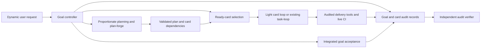
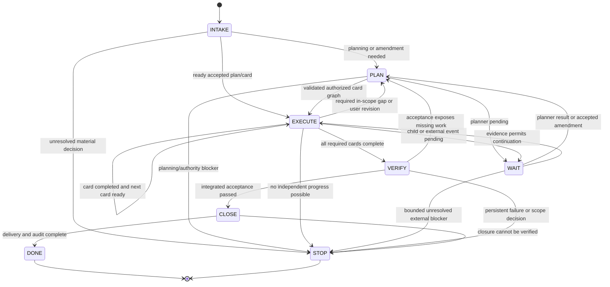
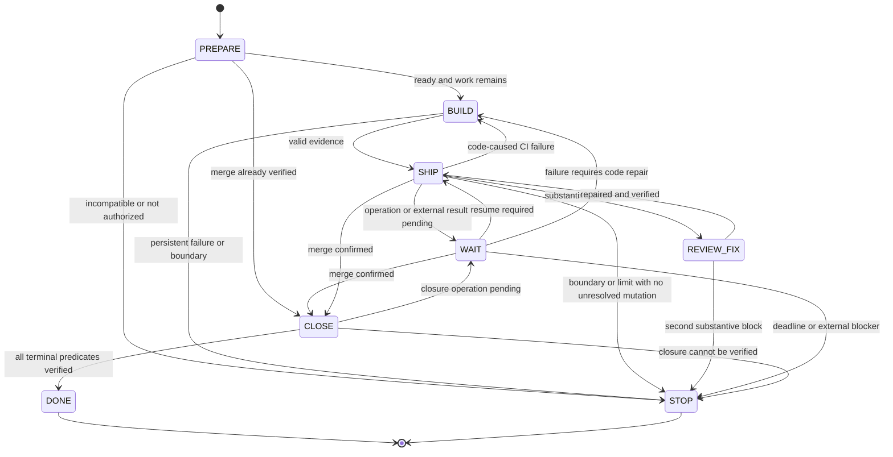
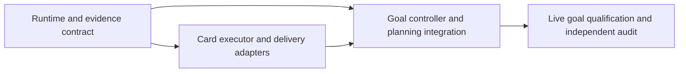

# PLAN: aidlc-loop — an autonomous, auditable agent from request to delivery

Version: 3.0 · 2026-09-10 · Status: revised implementation plan; not implemented or qualified.

This replaces the supplied aidlc-loop draft, including its incomplete requirement and deliverable sections. The current deliverable is this plan. It does not authorize execution of a card, changes to PR #394, repository configuration, or publication.

This copy follows MyInspection's `_local/` plan convention. In the upstream scaffold repository, publish it as `docs/plans/PLAN-aidlc-loop.md` if that repository's current rules permit tracked plans. Allocate implementation cards there after checking its registry. The original `T311-AIDLC-LOOP` identifier is a proposed identifier, not an assertion that the card exists or is available.

## 1. Goal and boundaries

### Goal

Accept a dynamic request of any supported size: build a new system, add a capability to an existing project, amend an existing card, fix a bug, or execute a ready card. Understand the request against the actual project, choose proportionate planning, use plan-forge and card projection when needed, then execute the resulting dependency-ordered cards autonomously until the complete user goal passes its acceptance checks or a specific blocker requires user input.

The user does not need to provide a card number, enumerate implementation steps or repeatedly say "continue". A small change may produce one card; a new system may produce many. The agent preserves the approved goal and its revisions, carries authorization forward, reacts to new information, and verifies the integrated result. An empty card queue or a collection of individually green cards is insufficient to establish that the user's requirement is complete.

The architecture has a goal controller for intake/planning/card selection/overall acceptance, and the existing single-card loop as its execution unit. Every observation, decision, risk check, operation and acceptance result is traceable through the goal, plan revision, card revision and execution evidence, including after compaction, wakeup and worktree cleanup.

The submitted system is the running agent, its tools, safeguards and evidence package. The skill is one component of that system.

### Scope

- One active user goal in one explicitly selected project, containing one or more cards. The goal controller owns planning and dispatch; each card has one feature worktree, one execution owner and at most one active ship operation. A repository-required administrative closure PR may use a separately declared temporary checkout.
- Sequential card execution is the default. Select the next dependency-ready card automatically after completion; the user need not trigger it. Optional parallel dispatch requires an already permitted host/project mode, disjoint resources and independent work. It is not required for v3 qualification.
- New-system, existing-feature, bugfix and card-amendment routes are supported. For a new system, select or create an authorized project workspace and bootstrap the approved scaffold before product cards; never turn an unrelated existing project into the new system. Clear routine product/docs cards use the light executor; Tier S or other mandatory heavy cards are delegated to the existing `task-loop` and their full checks.
- Existing `task.ps1`, `review.ps1`, `verify.ps1` and card checks retain authority over delivery. Add the smallest runtime support needed for recovery, tool-event capture and audit verification.
- Remote delivery with independent blocking review and live CI is the challenge qualification path. Local delivery is an explicit operating mode with its own completion evidence.
- Fable 5.1 remains the initial planned author model, but the intake/planning/execution contracts are model-independent. Qualify another author host against the same tests rather than attributing autonomy to a model name. Record actual model/host versions; reviewer selection follows repository configuration and stays independent. Follow the repository's effort routing, with retries capped at high; never use xhigh/max inside a repeated loop.

### Changes from the original proposal

| Original rule | Replacement |
|---|---|
| Input must be one ready card | Accept natural-language requirements or a card; normalize them into a versioned goal and create only the cards needed |
| Stop after the card completes | Automatically select the next ready card; goal completion additionally requires integrated acceptance |
| Always use the same planning process | Use a bounded one-card route for small work; use plan-forge for genuinely substantial or uncertain planning |
| Only DONE or STOP can end a turn | WAIT may yield after a confirmed wakeup or monitor registration; only DONE/STOP terminates the run |
| Prose only; no new script, gate or persisted state | Reuse existing runtime capabilities; permit a small recorder/verifier and durable run events where required |
| Run start on every entry | Start only when the worktree is absent and no completed or recoverable run already exists |
| Run failing tests, then implement | Keep behavioral RED-first; generate a phase receipt when required by the verified installed controller |
| No-verdict never consumes a round | Distinguish semantic review outcomes from the installed script's enforced counter; never override the latter in prose |
| Advisory review can merge findings | Qualification requires blocking review and no unresolved defect introduced by the candidate |
| Rerun every failed CI job | Diagnose first: repair code defects; rerun only a justified transient failure |
| Cleanup exit 0 means DONE | Verify merge, closure commits, retained evidence, cleanup and cancellation explicitly |
| One small replay proves speed | Separate functional qualification, live-response evidence and a comparable timing pilot |

### Boundaries

Do not modify `.claude/skills/task-loop/`. Reuse its heavier card execution where required. Add only the local goal controller needed to plan and dispatch cards; do not add a service, database, dashboard, general-purpose workflow engine or distributed queue. Do not expand the approved goal, bypass gates, weaken acceptance/tests, auto-reset review caps or auto-approve the author's PR. Do not run the full planning workflow or a full-repository survey for every small bug. Existing mandatory project checks still apply.

No new task-card fields are required: goal/revision/card relationships can live in the goal manifest and existing `plan_ref`/dependency fields. Runtime metadata belongs to run records. Follow-up issues are created only within the goal's authorized repository and issue-writing scope; no email or chat notifications are implied. A gap required to satisfy the goal becomes in-scope planned work; an unrelated improvement remains a follow-up and does not expand the goal.

### Success and claims

Functional success means every mandatory acceptance item of the current goal revision is satisfied on the integrated deliverable, with all required cards, closure and audit evidence accounted for. Section 8 tests both the outer goal loop and the inner card loop. The separate median-under-two-hours target applies only to the declared routine-card pilot, not to an entire new system. Report goal planning time, total elapsed time, card outcomes and acceptance results separately.

The existing three-hour default is a per-card action-admission limit from that card's first run-start event, including waits; it is not a three-hour cap on the whole goal. At expiry, reconcile the card's issued operations with a default five-minute grace and record a card blocker. The controller may continue independent ready cards, but cannot declare the goal done while required work is blocked. Carry any explicit user/project total time or spend limit in the goal contract and enforce it across planning, cards and revisions; never reset it by creating a new card. Without such a total limit, continue while verifiable progress is being made, subject to bounded planning/repair attempts and actual host/provider availability. Never declare completion to satisfy a timer.

The challenge wording supplied by the user is the requirements source. No named organizer's eligibility, required cloud platform or official scoring rubric has been established. Qualification here demonstrates those supplied capabilities; it does not claim external certification.

## 2. Input routing and minimum acceptable loop

### Input

After installation, use:

```text
/loop /aidlc-loop <request, goal reference, or FullTaskId>
```

Examples of supported inputs:

- "Build an inspection management system with these workflows and acceptance criteria."
- "Add PDF export to this existing project."
- "Change T2-EXAMPLE to support the revised requirement."
- "Fix the crash when I import this file."
- "Run T1-EXAMPLE to completion."

Example card IDs are illustrative, not existing tasks. Natural-language triggers such as `aidlc <request>` and `自动完成 <request>` select the same entry. A plain skill invocation does not itself create a scheduler; it can operate within the current turn using supported completion notifications. Unattended cross-turn continuation requires the verified scheduled entry above. Persist a goal identity on first intake; repeated wakeups resume that goal rather than creating another goal from the same prompt.

| Input | Minimum planning route | Completion target |
|---|---|---|
| Ready card | Resolve the authoritative card and its plan/dependencies; reuse the existing contract | That card's requested outcome and applicable integrated checks |
| Small, clear bug or change | Inspect relevant code/tests, reproduce or define behavior, write/update a concise plan and one coherent card | Demonstrated fix/change plus relevant regression checks |
| New feature in an existing project | Impact analysis against existing architecture and invariants; amend the plan and project only affected cards | New behavior integrated with existing workflows |
| New system or substantial/uncertain requirement | Define goal and boundaries; create the plan; run plan-forge; reuse its validated card projection or run decompose-cards when needed | The agreed end-to-end system workflows, not merely a generated scaffold |
| Existing card amendment | Compare the requested behavior and current card/run status; version the amendment or create a successor as specified below | If only the card text was requested, finish the amendment; execute changed behavior only when that is part of the request |

Resolve card identifiers against the authoritative registry. A numeric shorthand must match exactly one card. Validate identifiers before constructing paths. Merely naming a completed card does not restart it; a requested change to its delivered behavior takes the amendment/successor route. A vague new-system request is first made testable: use discoverable context and explicit assumptions, asking only for decisions that materially change the product or would make implementation unusable.

### Observable loop

1. Intake the request, resolve the project, inspect relevant context and record a testable versioned goal with its authorization boundary.
2. Select the minimum planning route, audit substantial plans through plan-forge and validate the card graph before registration/dispatch.
3. Choose the next ready card, apply its existing execution/risk gates and run the card loop; react to results without requiring another user prompt.
4. Recompute readiness after each result or accepted requirement change; repair or replan only the affected scope, preserving completed evidence and budgets.
5. Verify the integrated goal acceptance, complete delivery/closure and preserve the goal-wide audit chain before GOAL_DONE. Stop only for a real unsatisfied dependency, decision, limit or operational blocker after useful independent work is exhausted.

The target user experience is one goal-level authorization for autonomous planning and routine in-scope card execution, carried across wakeups and cards. This authorization never waives frozen-contract, destructive-action, dependency-license or other mandatory project/harness gates. The current plan-forge integration still requires human signoff; section 3 makes the required bounded-delegation integration explicit rather than pretending it already exists.

### Output

GOAL_DONE produces the requested integrated deliverable, its overall acceptance results, all required card/PR outcomes, committed plan/card/document closure and the goal-wide evidence index. Each card supplies its own verified terminal receipt. GOAL_STOP records completed, blocked and not-started work, current requirement revision, active operation status and the precise next action. A single card's DONE/STOP does not itself terminate a multi-card goal.

Progress remains concise:

```text
[AIDLC] goal=<goal_id> revision=<n> state=<goal_state> cards=<done>/<required> next=<action>
[AIDLC-CARD] goal=<goal_id> card=<id> run=<run_id> state=<card_state> review=<count>/2 next=<action>
[AIDLC-STOP] card=<id> reason=<class> pr=<number|none> next=<action>
[AIDLC-GOAL-STOP] goal=<goal_id> revision=<n> reason=<class> remaining=<count> next=<action>
```

These lines are for people and diagnosis. Structured records and script contracts determine behavior. Add a brief explanation when a real decision or blocker needs it; do not suppress necessary information to satisfy a one-line rule.

## 3. Technical stack and compatibility

Use PowerShell 7, Git, the authenticated GitHub CLI, existing project test commands and the selected LLM host. Prefer built-in JSON and hashing facilities; no new runtime dependency is planned. Any dependency later found necessary requires the repository's normal proposal and license process.

Claude Code supports self-paced `/loop` and `ScheduleWakeup`; task execution occurs between turns and requires a running session. Host resumption does not restore every background process. Probe the installed tools and their schema rather than assuming availability from the model name. See [Claude Code scheduled tasks](https://code.claude.com/docs/en/scheduled-tasks).

### Compatibility requirements

Goal INTAKE records the host/planner capability snapshot; each card PREPARE verifies its execution prerequisites. Revalidate affected capabilities if the host, scripts, configuration or environment changes.

| Capability | Requirement and incompatible behavior |
|---|---|
| Identity and readiness | Canonical repository, base, card, dependencies and tier are resolved; no ambiguous owner or target |
| Planning | Installed plan-forge/card-projection entry points, output schemas, audit results and allowed planning depth are verified |
| Planning authority | Scoped delegation is supported and recorded, or the existing human signoff path is explicitly retained; a `ready` verdict alone is not approval |
| Delivery phases | Installed start/red/ship/cleanup behavior and supported arguments are verified |
| RED policy | Record whether the controller requires a phase receipt, accepts an explicit non-TDD exemption or has a verified newer receipt-free contract; preserve the project's behavioral testing requirement |
| Review | Independent backend available; fresh candidate-bound verdict required before remote merge |
| Review accounting | Actual counter, artifact format and internal retry behavior are known; assign one retry owner; resets require explicit adjudication |
| Capture | Required model/tool events can be retained and correlated; loss cannot silently permit a mutation |
| Scheduling | Record actual tool schemas, wakeup scope, cancellation support and the single completion-delivery owner for each wait |
| Closure | Record the supported closure strategy, exact metadata paths, base and checks before work starts; unsupported closure is a preflight blocker |
| Authentication | Configured personal account and repository permissions pass the existing guard; never downgrade to local mode on auth failure |

Tool permissions are also preflight inputs. Required edits, phase commands and repository writes must be permitted by the host under the existing user authorization. A skill cannot override a host permission prompt. Use the repository's approved, scoped tool permissions; do not make global permission bypass a prerequisite or change permission settings during a run to evade a denial.

Current MyInspection observations are compatibility evidence, not a declaration about an uninspected upstream version. The feedback recheck inspected HEAD `e56b00fd2ac4eeade7eec86d0e17a756fbfc734f` on 2026-09-10. Runtime admission records the actual script digests because a checkout may contain uncommitted controller changes:

- `task.ps1:319` rejects an existing worktree. Resume must inspect the real tree and receipts instead of treating every start failure as success.
- `task.ps1:430–437` requires the `-Phase red` receipt for a normal TDD ship.
- `review.ps1:115` uses `<branch>.json`; `review.ps1:820–829` counts infrastructure block outcomes as well as substantive blocks.
- The inspected configuration has no `ReviewGate=advisory|required` switch. Remote ship already blocks on unsuccessful review.
- `task.ps1:260–268` logs caught gate failures on a best-effort basis. That ledger alone cannot support complete audit claims.
- `task.ps1:1201–1205` prints R5 reminders; cleanup does not itself commit card or documentation updates.

Consequently, PR #394, T302 or another upstream change is not a substitute for capability verification. If installed review accounting prevents the desired recovery, record STOP/tool and identify the required upstream fix; do not reset or bypass the counter. Wiring a new helper into an incompatible host is an implementation prerequisite, not a silent fallback.

Feedback referring to T68 removing RED receipts or to per-round verdict files may describe a newer upstream controller. Require its exact repository/revision and inspect that contract before applying the advice. Neither a quoted line number nor a version-independent rule to add/remove `-Phase red` is sufficient.

### Actual plan-forge integration and approval contract

The inspected repository provides `.claude/workflows/plan-forge.mjs` and `.claude/workflows/decompose-cards.mjs`, documented by `docs/PLAN-FORGE.md`; no standalone `plan-forge/SKILL.md` was found in the inspected skill locations. These workflow entry points are the integration source, not an invented skill API. A thin entry skill may call them through a supported host adapter during implementation.

Current documented calls are `Workflow({ scriptPath, args })`: plan-forge accepts `planPath`, optional `priorReviewPath`, `claudeMdPath`, `specsReadmePath` and `templatePath`; decompose-cards accepts the relevant paths, optional `reportPath` and approved `decisions`. Record actual outputs and validation results. Plan-forge already includes decomposition/card audit; do not automatically run a second decomposition if its card projection is usable and matches the accepted plan revision.

The installed documentation says plan readiness still requires human confirmation and card registration is plan signoff (`docs/PLAN-FORGE.md:29,35`). V3 therefore includes a tested bounded-delegation policy: when the user has authorized a concrete goal, routine plan choices and card registration within that recorded scope may proceed without repeated approval. Amend the authoritative workflow/policy and any enforcing hook together before claiming this mode works. Changes to the actual goal, high-risk operations and matters explicitly reserved to a human still require the appropriate decision. Unmodified installations continue to stop at their genuine approval gate; the skill cannot silently bypass it.

Do not invent a cheap-mode flag for the installed workflow. For a small clear bug, use the existing direct one-card planning route with required card validation. For substantial work, call the actual plan-forge workflow and charge its model/tool cost to the goal. If a reduced planner is necessary, implement and qualify it as an explicit contract change; do not claim a full planner audit ran when it did not.

## 4. File-level implementation plan

Paths below are proposed upstream targets, not files created by this plan. Inspect their actual locations and register complete `allow_paths` before implementation.

| Surface | Planned change |
|---|---|
| `.claude/skills/aidlc-loop/SKILL.md` | Short requirement/card entry: input routing, goal progression, planner/card-executor dispatch and overall completion |
| `.claude/skills/aidlc-loop/card-loop.md` | The existing light card-loop contract, loaded by the entry only when a routine card executes; task-loop remains the separate heavy executor |
| `docs/DEVOPS-WORKFLOW.md`, `docs/PLAN-FORGE.md`, affected approval/entry documentation | Authoritative goal/card integration and tested scoped planning delegation, with existing mandatory human gates preserved |
| `.claude/workflows/plan-forge.mjs`, `.claude/workflows/decompose-cards.mjs` | Reuse actual interfaces and output projection; change only where tested integration/delegation requires it, without inventing a fast flag or rerunning unchanged planning |
| `scripts/aidlc.ps1`, `scripts/_aidlc.ps1` | Proposed thin goal/card controller and shared recorder/verifier: input/status, ready-card selection, preflight, closure dispatch, audit and event plumbing; no duplicate ship or planner implementation |
| `scripts/task.ps1`, `scripts/review.ps1` | Minimal event capture around real phase/gate results; audit checks immediately before relevant mutations; preserve review output before overwrite |
| Existing host tool hooks/configuration | Capture model turns, file edits and tool calls under the same run identity; enforce declared mutation boundaries |
| `specs/aidlc-run.schema.json`, `specs/aidlc-goal.schema.json` | Versioned event/manifest and goal-revision/acceptance/dispatch contracts; no new card fields |
| Existing task/review tests; `tests/aidlc.ps1` | Extend neighboring tests for changes to existing units; a new test file only for the genuinely new recorder/recovery unit |
| `CLAUDE.template.md`, `TEMPLATE-README.md`, `docs/DELIVERY-CHAINS.md` | Downstream entry and index updates, guarded by capability qualification; preserve meta-repo task-loop default |
| `scripts/_config.ps1`, `.github/workflows/ci.yml` | Only needed configuration, measured budget adjustments and relevant checks; identify Tier S obligations from actual paths |
| `docs/references/` and its index | Concise source references with URL, ownership attribution and verification date; no wholesale source mirroring |
| Plan, registered implementation cards and evidence index | Bind requirements to commands and recorded outcomes; avoid an untracked extension to the original card budget |

Keep each always-loaded skill entry small; 6,000 characters remains a target for the entry body, not for all goal and card contracts combined. During B/C preparation, write uninstalled drafts and measure with the exact eventual check, excluding frontmatter consistently, before freezing numeric DoDs. No skill draft is delivered by this plan revision and its length is not yet verified. Load goal planning and card detail only on the matching route; preserve mandatory recovery/risk contracts in authoritative references. Measure actual description/document budgets rather than copying old headroom figures. Include every affected teaching surface in the scope sweep.

### Runtime artifacts

Use directories under the canonical project's existing ignored runtime area, resolved independently of feature worktrees:

```text
runtime/aidlc/goals/<goal_id>/
  events.jsonl
  revisions/<revision>/
  generations/<generation>/
    manifest.json
    audit-result.json
runtime/aidlc/cards/<TaskId>/<run_id>/
  events.jsonl
  artifacts/
  manifest.json
  audit-result.json
```

The goal record links the accepted plan revision, card registry/revisions, dispatches and card-run manifests. It records the original user request, amendments and delegated authority; it does not become a second implementation plan. The accepted plan remains the implementation truth, and cards remain its projections. Persist the accepted plan/goal snapshots where project policy allows so an ignored local file loss cannot erase the requirement history.

Repository/goal/card ownership metadata is operational bookkeeping. Events are the durable history; any ready-set or status cache is disposable and rebuilt from those records plus Git/GitHub/process evidence. Runtime files do not enter feature commits. Goal/card evidence survives cleanup and has independently retained manifest checkpoints.

## 4.5 Module design

Use one local goal controller around existing planning and delivery tools. The LLM interprets requirements and proposes plans/decisions; deterministic code validates card readiness, goal revisions, permissions, ownership, freshness, evidence recording and merge conditions. Shared-state registration and card dispatch remain owned by the controller even when the existing planner uses its own bounded agents.



The controller must not reimplement plan-forge, PR creation, scope checks, reviewer invocation or merge policy. Read the resulting planner/card events and select the next action. Reuse a host trace export when it passes the same capture/retention tests, including any delegated planner/executor operations; missing integration is part of the relevant implementation work package.

No new per-card LLM audit ceremony is required. Deterministic audit checks run automatically; independent audit of the system and challenge evidence is a qualification activity. Existing mandatory independent R3 review remains in the delivery path.

## 5. Goal controller and card execution

### Goal contract, planning and live changes

Intake fixes `goal_id`, project/workspace, original request and intent type, current requirement revision, accepted assumptions, measurable end-to-end acceptance, excluded scope, authority/risk policy and any explicit total limits. The accepted plan and card-projection digests, required versus optional outcomes and requirement-to-card/check mapping are versioned under that identity. Preserve the raw request and its amendments as evidence; use a concise working contract for execution.

Planning depth follows the change, not prompt length. Reuse a sufficient existing plan/card; write one concise plan/card for a narrow reproducible bug; run plan-forge for new architecture or substantial ambiguity. A new system includes an authorized workspace/scaffold bootstrap and at least one verifiable vertical user workflow. A generated project skeleton alone is not goal acceptance. Do not rerun plan-forge after every successful card or on a wakeup without relevant new input.

A planning episode permits the initial full planning/audit invocation and one corrective invocation by default. Persist an episode identity, deadline and attempt allowance before dispatch; derive the deadline from a verified workflow/host timeout and any tighter goal limit. An unknown or interrupted invocation is reconciled before retry and cannot be silently refunded. A material new requirement or independently evidenced integration gap may open a linked episode; cosmetic plan/card revisions cannot renew an exhausted allowance for the same problem. Missing a usable timeout/cancellation contract is a planning capability blocker. Report planning limits separately from the three-hour card default.

Reuse valid `decomp`/`cardAudit` output from plan-forge. After a material plan amendment, re-audit the changed assumptions and reproject only affected cards using the supported workflow. Before registration, validate unique IDs, existing references, acyclic dependencies, readiness, scope, measurable DoDs, required-path coverage and the delegated authority to register. Record a card-set revision atomically; partially written or failed registrations cannot become runnable.

Handle existing cards by their actual lifecycle:

- Unstarted card: amend the accepted plan and card projection, revalidate dependencies/DoD/scope and register the new revision under the permitted policy.
- Running or reviewed card: pause new affected dispatches, reconcile issued operations and assess impact. Adopt a formally recorded contract amendment or split the changed requirement into a successor; preserve old tests, receipts, limits and completed effects. Never change acceptance silently to make a failing result pass.
- Merged card: retain its immutable outcome and create a linked change/repair card for newly requested behavior. Do not relabel the old delivery as if it had implemented the new request.
- Card-text-only request: revise and validate that artifact; do not infer permission to implement the changed application behavior.

User steering increments the same goal's requirement revision. At a safe boundary, record the amendment, impact and current approval status; preserve unaffected cards/evidence and invalidate only affected acceptance or candidates. A dispatch token binds goal generation/revision, card revision, owner and candidate. The mutation/merge boundary rejects an obsolete dispatch until the controller explicitly revalidates it for the accepted revision. New user authorization is recorded where needed; an agent-discovered idea cannot expand the goal by itself.

An accepted amendment records every affected card as retained, amended, superseded or canceled. Superseded work keeps its historical effects and evidence but leaves the current required set only with an explicit outcome-to-replacement mapping or a user-authorized scope removal. Reconcile in-flight effects before removing a card from dispatch. New input after GOAL_DONE/GOAL_STOP opens an explicitly authorized continuation generation linked to the old terminal record; it does not erase that record. Scheduled tokens include this generation, so an old queued wakeup cannot reopen completed work or impersonate the new request.

### Goal states and automatic card progression

Goal states are INTAKE, PLAN, EXECUTE, WAIT, VERIFY, CLOSE, DONE and STOP. These are distinct from the card states below; record the state scope explicitly. One user goal may contain many card-run IDs, but a wakeup resumes the same goal.

| Goal state | Evidence and next action |
|---|---|
| INTAKE | Resolve intent, project, existing work, testable goal, authority and capabilities. Reuse a valid contract or establish the minimum missing context |
| PLAN | Create/revise the accepted plan and validated card projection at the required depth. Register within a supported delegated scope; otherwise report the precise approval needed |
| EXECUTE | Derive the ready set, select a card deterministically by dependencies and declared priority, dispatch the proper executor and continue automatically after each completed card |
| WAIT | A planner/card/CI operation or verified external condition is pending. The parent owns delivery notifications and reconciliation; do not dispatch another operation for the same signal |
| VERIFY | No required runnable work remains and required cards are complete. Run the goal's integrated acceptance against the actual integrated candidate |
| CLOSE | Acceptance passed; finish goal-level documents/deliverables, evidence index, resource accounting and required publication/closure already authorized |
| DONE | Every mandatory outcome of the current accepted goal revision, integration/closure and audit requirement is verified. Return the existing result on later wakeups |
| STOP | A global risk/authority/audit/cancellation/limit condition applies, or all useful independent work is exhausted with a real blocker. Record partial completion and the exact missing action |

An issued mutation with unknown outcome always enters bounded reconciliation before terminal handling. A persisted goal terminal disposition prevents a stale wakeup from starting new work. Reuse the existing late-wakeup and cancellation controls at the goal scope.



Compute readiness from the accepted graph and actual prerequisite integration evidence, not card filename order or checkbox text. A ready card has the current registered revision, all required dependencies satisfied, available resource ownership and no unresolved approval or blocker. Sequential execution is default. If a card stops, mark it blocked and continue independent ready work where safe; do not run its dependents, abandon the requirement or report overall completion. A global authority/audit failure stops new mutations across the goal.

If the ready set is empty but required work is incomplete, distinguish a known external wait from a cycle, missing dependency, blocked card or inconsistent projection. An empty queue is never automatic success. A plan `fix-first` result or integration gap returns to PLAN only within the accepted goal and supported approval policy. The same ineffective planning/repair correction twice stops that branch; count failure identity across revisions and successor cards so replanning cannot reset a review or repair cap.

The parent is the sole scheduler for nested goal execution. Card/planner executors return progress, WAIT or terminal evidence; they do not create independent `/loop` jobs. A standalone card invocation is represented as a one-card goal. Child DONE cancels only child-owned resources and reports to the parent; it never cancels the parent's continuation to the next card. Ownership and command scope remain checked even if optional parallel execution is later enabled.

The goal status probe reads the current durable contract/revision, validated graph, dispatch ownership, child receipts and integrated base, then derives readiness and blockers. It never relies on a model-maintained card count. A Tier S dispatch calls the existing task-loop in a supported non-scheduling execution mode through an adapter that can return WAIT and a verified result. Prove that mode and its result contract in preflight; if unavailable, report STOP/capability for that branch rather than nesting another scheduler or treating a conversational completion as a card receipt.

### Overall acceptance and completion

Maintain a coverage map from each mandatory user outcome to plan section, current card(s), integrated acceptance check and retained result. All mandatory outcomes must be covered. Known gaps required for that outcome are planned repair work, not deferred nits. Optional unrelated improvements may be filed as issues without blocking goal completion; the classification and its scope basis are recorded.

Goal verification runs on the actual integrated base/deliverable and records its SHA/artifact digests, environment and commands. Individual card tests are reused where valid but do not replace end-to-end checks for cross-card behavior. Recheck freshness if integration changes before finalization. If the combined system fails despite all cards being green, remain in VERIFY/PLAN, create only authorized in-scope repair work and continue; never weaken the goal acceptance or declare DONE because the cards were merged.

GOAL_DONE requires the current goal's mandatory outcomes and integrated checks to pass, no unresolved required card/decision, all authorized delivery/closure completed, every card-run manifest accounted for, a verified goal evidence index and no unaccounted active operation or pending goal wakeup. Source changes/PRs, a runnable artifact, documentation or a deployment are required only when included in the accepted deliverable. Do not deploy a new system merely because its code builds. A STOP retains all completed work and exact remaining conditions for a safe later continuation.

### Card loop scope

The rest of section 5 specifies the child executor. Its identity, review cap, deadline, one-writer rule and DONE/STOP refer to one card. The parent interprets the result using the accepted goal graph and overall acceptance; a card's terminal state alone is not GOAL_DONE.

### Persistent identity and freshness

The first run-start event fixes `run_id`, repository/card identity, first-start time, deadline, author/host/tool versions, operating mode, authorization scope and resolved card/plan versions. Resuming keeps that identity, deadline and counters. Starting a new run to erase limits is prohibited; a human-authorized continuation links its predecessor and reason. Read the durable terminal disposition and deadline first on every wakeup, before admitting new work. Filesystem creation/modified times and a branch's oldest commit are not reliable run-start clocks. A PR-body marker may link or summarize the run, but mutable PR text is not its counter or clock authority. If the durable record is unavailable, recover it from verified retained evidence or STOP/audit; never guess a fresh start time.

Every observation, decision and action refers to the relevant candidate and base. For uncommitted tests or code, a commit SHA alone is insufficient: record a working-tree manifest covering relevant tracked and untracked inputs, deletions, command, configuration and environment identity. Committed evidence additionally binds candidate SHA, base SHA and applicable review/test contract versions. Changes invalidate affected evidence; uncertain bindings require re-verification.

Admission uses a repository/card owner record and an atomic action lock. A wakeup attaches to the same owner. Process identity includes its start time and operation identity, not just a reusable PID. A second writer cannot execute edits or ship. An uncertain owner or an issued operation with an unknown result must be reconciled before another mutation.

### Named state probes

The runtime's status action performs these probes and returns structured evidence; the skill does not invent shell searches at each wakeup. `$Main`, `$Wt`, `$TaskId`, `$Branch`, `$Base` and `$Repo` below come from validated run/configuration data. All GitHub operations use the existing account guard and an explicit repository. Run commands with argument arrays and check their exit status before consuming output.

| Fact | Probe / authoritative source | Failure or ambiguity rule |
|---|---|---|
| Card and readiness | Resolve `specs/tasks/<TaskId>.md` or the authoritative archive entry; run main-checkout `pwsh -NoProfile -File scripts/check-cards.ps1 -TaskId $TaskId` where applicable; parse the declared dependency IDs | Missing active card, failed card validation or unmet dependency is STOP/card. An archived completed card returns verified prior evidence, not a new start |
| Existing worktree and owner | `git -C $Main worktree list --porcelain`; exact branch-ref and canonical path match; compare common Git directory and durable owner | A directory name alone is insufficient; mismatched, duplicate or unknown ownership is STOP/ownership |
| Candidate and uncommitted work | `git -C $Wt rev-parse --verify HEAD`; `git -C $Wt status --porcelain=v1 --untracked-files=all`; relevant working-tree manifest | Missing/dirty state is interpreted from its actual contents; never infer no work from an empty commit list |
| Base and branch relationship | Resolve recorded local base or explicitly refreshed remote base; `git -C $Wt rev-list --left-right --count <base-ref>...HEAD`; compare observed base OID with recorded OID | A fetch failure invalidates remote freshness; base movement takes the recovery route below. A failed probe is not an empty diff |
| Feature PR identity | `gh pr list --repo $Repo --state all --head $Branch --base $Base --json number,state,headRefOid,baseRefName,mergedAt,url --limit 100`; then `gh pr view <number> --repo $Repo --json state,mergedAt,headRefOid,baseRefName,baseRefOid,mergeCommit,statusCheckRollup` | Detect a full result page and use a verified paginated query. Match retained run/PR identity; multiple candidates, a retargeted PR or closed-unmerged work cannot be silently selected/recreated |
| DoD outcome | Execute the parsed card command in its intended worktree and retain actual process exit plus bound inputs/output | Reuse only a fresh verified receipt; unknown outcome requires re-verification, not an assumed zero |
| Reviewer result and counters | Parse the installed verdict schema/artifact location and its enforced counter; correlate durable backend-attempt events with candidate/base and dispatch identity | Never count filenames as substantive reviews. Deduplicate archived copies and distinguish valid review decisions, infrastructure outcomes and the script's own counter |
| CI rerun state | `gh run view <run-id> --repo $Repo --json databaseId,attempt,status,conclusion,headSha,jobs,url`; compare the persisted rerun operation and original attempt | Queued/in-progress means WAIT; a successful rerun is reused; changed attempt/outcome is reconciled before another request |
| Closure and terminal evidence | Recorded closure PR/commit identity, target-base integration, artifact manifest/receipts, cleanup postconditions and scheduler inventory | PR MERGED or card `status: merged` selects CLOSE until every DONE predicate is verified |
| Active operation and wakeup | Durable operation ID plus host process/task registry, PID/start identity and the run's scheduler entry | Unknown ownership/outcome requires reconciliation; no duplicate dispatch |

These are read/observation probes except the explicitly identified remote-ref refresh and DoD execution, which still pass the audited action boundary. Polling summaries do not replace the delivery scripts' exact candidate-bound CI and merge checks.

### State selection

States remain PREPARE, BUILD, SHIP, REVIEW-FIX, WAIT, CLOSE, DONE and STOP. On each entry, validate evidence and select a state by the following priority; do not infer it from the last chat message.

| Priority / state | Evidence | Next action |
|---|---|---|
| WAIT / reconciliation first | An issued mutation is still running or its external outcome is unknown, including after cancellation, deadline or audit failure | Stop admitting new mutations; perform read-only reconciliation or safe cancellation; retain the pending stop reason |
| STOP | A terminal reason applies and issued mutations have been reconciled, or the bounded reconciliation grace has expired with their outcomes explicitly recorded as UNKNOWN | Retain evidence and any unresolved operation identities; report the exact next action; cancel the run's pending wakeups |
| DONE | All terminal predicates below hold | Return existing result; perform no further task work |
| WAIT | A known operation is running, or an external result/admission is pending | Attach or schedule; do not dispatch duplicate work |
| CLOSE | Merge is verified but any closure predicate is incomplete, regardless of card status | Complete only missing closure steps |
| PREPARE | No validated run context or new authorized run | Resolve capabilities and readiness; start only if appropriate |
| REVIEW-FIX | Fresh substantive review block and remaining review allowance | Fix candidate defects or record an evidence-backed dispute; return to SHIP |
| BUILD | Acceptance work or required valid test evidence is incomplete, including code-caused CI failure or recorded base movement | Perform the next bounded test, code repair or authorized merge-based synchronization |
| SHIP | Candidate ready, no known active operation, merge incomplete | Re-run the same authorized ship command with the same mode/flags, whether or not a PR already exists |

For overlapping facts, reconciliation has priority even when a stop reason is already present. It permits no new delivery operation. If the provider cannot resolve the outcome within the bounded reconciliation period, record the uncertainty explicitly and stop with the operation identity and manual reconciliation step; never assume it was canceled or retry it. A forcibly interrupted host may require this check on resume. A corrupt state or an unclassifiable failure is STOP/tool, not success or an unlimited retry.

### Moving base and unexpected ship failures

Base movement is an operation within BUILD, not a ninth state. After any active ship has finished, record old/new base OIDs and inspect the relationship. Refresh the configured base explicitly, then use the repository's approved merge-based synchronization in the feature worktree when integration is required. Never rebase, amend or reset published/receipt-bound history. An automatic synchronization requires a clean, known-owned tree or the repository's documented preservation procedure; otherwise stop and explain the blocked condition.

Resolve an in-scope conflict once, preserve the resulting merge commit and re-run affected tests plus the normal ship path, including fresh review where required. If conflict resolution needs out-of-scope work, forbidden changes or the same conflict/ineffective repair recurs, STOP/scope or STOP/tool with the conflict evidence. If base movement happens again, inspect the new OIDs rather than looping the previous merge blindly. Retargeting a PR to another base is a scope decision, not routine base advancement. No merge after base/head movement may reuse invalidated approval.

Every non-zero ship exit has a disposition: use verified scope/risk/auth/CI/review classifications when available; any unmatched failure is STOP/tool with phase, exit, command identity, last recognized script sentinel and retained diagnostic output. Do not assume every version emits `[SHIP-TIME]`. Unexpected exit zero also cannot establish DONE without its postconditions.



`REVIEW_FIX` is the diagram identifier for the externally reported state `REVIEW-FIX`.

### BUILD and verification routing

All phase commands use the main checkout's controller. Enter the feature worktree only for edits and its project test commands. The driver selects the appropriate phase; it does not run this entire list on every entry. Set `$TaskId` to the validated identifier and preserve any approved base/mode flags from the run record.

```powershell
pwsh -NoProfile -File scripts/task.ps1 -TaskId $TaskId -Phase start
pwsh -NoProfile -File scripts/task.ps1 -TaskId $TaskId -Phase red
pwsh -NoProfile -File scripts/task.ps1 -TaskId $TaskId -Phase ship
pwsh -NoProfile -File scripts/task.ps1 -TaskId $TaskId -Phase cleanup
```

Read the card once per validated card revision. Re-read changed authority rather than trusting stale acceptance. For TDD cards, write a meaningful failing test and confirm the intended failure using the card's actual test command. On a receipt-requiring controller such as the inspected MyInspection version, run the main checkout's `task.ps1 -Phase red` while the behavior is still RED; that phase's DoD execution can supply the confirmation without a redundant test run. Preserve its receipt and output before implementation. On a verified receipt-free controller, retain the same behavioral RED observation through its supported audit path; do not recreate a retired gate. Infrastructure or syntax failure is not valid behavioral RED.

For genuinely non-TDD documentation work, use the repository's explicitly supported exemption, such as `-SkipRed` on the inspected controller, and record why it applies. Do not send an unsupported flag to a newer controller. Do not fabricate tests or weaken acceptance. New units may need new test files; existing units use their neighboring tests.

| Changed surface | Iteration checks |
|---|---|
| Product code/tests | Card DoD and relevant package tests; avoid a duplicate invocation when DoD already runs the same checks |
| Documents/cards | Card validation and the applicable document/DoD checks |
| Mixed changes | Union of the affected checks, deduplicated |
| Scaffold/Tier S surface | Route to task-loop and the repository's prescribed scaffold checks |

Ship still runs every mandated deterministic gate. The skill cannot suppress checks inside ship or claim to reuse evidence the installed script does not support. Reuse valid evidence only where the authoritative runner accepts it. Full scaffold selftests are not added to routine product cards. R4 and other explicit card/project obligations remain in force.

### Review, CI and retries

Two substantive review decisions per card are allowed by default: initial review and, when needed, one further review of the repaired or changed candidate. Count actual valid decisions, whether pass or block; also record the substantive block count and the installed script's enforced counter separately. Deduplicate by backend invocation identity, not filename. A second substantive block is STOP/review. If another review is required after the allowance is used, including after base movement, STOP/review rather than merging with stale evidence. A cap enforced earlier by the installed script also stops the run. The author never approves itself, manually merges around the script, changes reviewer wording to evade a finding or resets rounds autonomously.

| Outcome | Response and bound |
|---|---|
| Defect introduced by the candidate | Fix it or revert the defective change within approved scope; never defer it merely by opening an issue |
| Non-blocking nit or unrelated pre-existing defect | Record a deduplicated follow-up issue where authorized; link it from the PR |
| Disputed blocking finding | Preserve evidence and use the repository's normal bounded re-review/adjudication path; an issue does not override a block |
| No verdict, malformed output or timeout | Preserve raw output; distinguish actual adverse feedback from an external failure; never read exit 0 as pass. At most one retry across the entire script/driver stack, justified and permitted by the actual script counter |
| Confirmed reviewer quota/admission hold | WAIT until eligible, capped by the run deadline; unknown output alone does not establish quota exhaustion |
| Code-caused CI failure | Read the relevant logs, repair in BUILD, run affected checks and re-ship the new candidate |
| Justified transient CI failure | Rerun the failed job once for the same run/attempt/candidate; a repeat is STOP/ci |
| Same ineffective repair twice | STOP with stage, normalized failure signature, attempts and evidence |
| Unclassified ship outcome | STOP/tool immediately with the retained execution evidence |

Store retry identities durably. Normalize failure signatures by stage, error class and cause; cosmetic edits must not erase a repeated-failure limit. Keep substantive review counts separate from tool-dispatch counts and report the script's actual enforced counter. Preserve counters across compaction and wakeups.

For a no-verdict episode on a candidate, preflight records exactly one retry owner: `script` if the installed controller already performs the internal retry, otherwise `driver`. Initial dispatch plus one retry means at most two backend review invocations for that episode in total. If a T302-like script already used both, re-running ship to obtain a third attempt is prohibited. If internal attempts cannot be observed or established reliably, STOP/tool instead of assuming a retry remains. Admission holds that never invoke a backend remain distinct from a backend attempt. Do not classify a raw adverse review as infrastructure merely because its JSON is missing.

For CI reruns, persist the original `(run_id, attempt, candidate, failed-job-set)` and operation identity before requesting a rerun. Before every retry or wakeup, read the actual run attempt/status. An accepted, queued, running or completed rerun consumes the one rerun; a lost CLI response does not restore that allowance. Reconcile attempts before issuing another write. Script-owned reruns consume the same allowance as driver-owned reruns.

Follow-up creation has an operation identity based on repository, card, finding class and originating evidence. Search for the existing marker before creating an issue; after an uncertain API result, reconcile before retrying. Missing issue-write permission leaves a recorded pending disposition and a specific closure blocker when issue creation is required. It never silently drops a finding.

### WAIT and pacing

WAIT is a pause in execution, not task completion. Each pending signal has exactly one completion-delivery owner: background completion/Monitor notification, or scheduled wakeup. A background process may exist in either case; what must not be duplicated is the notification/poll mechanism for the same result. With a working in-turn notification, remain available for that result and do not add a second wakeup for it. For scheduled polling, confirm that no competing notifier owns the signal, persist the wait/operation identity, confirm exactly one next wakeup, then yield the turn. Changing owners requires canceling/reconciling the old registration first. On waking, inspect the operation and external evidence before re-running ship.

Bind scheduling arguments to the live tool schema. Do not infer `delay`, `delaySeconds`, `prompt`, `noop` or cancellation fields from a different release, and do not treat plan notation as callable parameters. Current official tools documentation specifies `ScheduleWakeup` cancellation using `stop: true` from Claude Code v2.1.202; the local CLI reports v2.1.267, but that alone does not prove this session exposes or honors the tool. Package A qualification must demonstrate scheduling and cancellation in the actual target host. See [Claude Code tools reference](https://code.claude.com/docs/en/tools-reference).

Prefer event notifications. Poll active CI at 60–120 second intervals when necessary; longer waits may follow a verified quota reset, within the host's supported limits and the remaining deadline. Do not rely on the host's implicit twenty-minute fallback. Do not claim a wakeup was scheduled unless the call succeeded. Missing scheduling support produces STOP/capability for scheduled mode.

Keep quiet on unchanged external status except for required audit observations. A pending stop reason does not bypass reconciliation. Once task operations are resolved or explicitly terminalized as UNKNOWN, persist a no-new-work terminal disposition before canceling scheduled delivery. Verify removal of this run's scheduled work only, then finish the audit/terminal envelope. A stale wakeup must check that disposition before any delivery mutation and return the existing outcome; it cannot recreate the worktree or reset limits. Unverified cancellation is STOP/capability with the remaining scheduler identity, not a claim that the loop is fully canceled. This guard limits damage even if a host delivers an already-queued prompt after cancellation.

Outside scheduled mode, a plain invocation can progress only while its turn and supported completion mechanisms remain active. If continuing requires a new turn and no confirmed delivery mechanism exists, report STOP/capability with the exact resume command. An unexpected host exit pauses execution; reconstruction prevents duplicate actions on resume, but this version does not promise operation while the host machine or session is stopped. Do not generalize Ctrl+C, Esc or daemon behavior from an anecdote about another version; test the supported cancellation path explicitly.

### CLOSE, DONE and STOP

Before cleanup, copy and verify ephemeral review/test evidence into the durable run directory. Closure follows a strategy fixed during PREPARE:

On every CLOSE entry, reconcile all retained review findings, including pass-with-nits outcomes and earlier dispositions that remain applicable. File only missing required follow-ups, confirm their remote IDs and PR links, and preserve their operation identities before continuing. Do not rely solely on the latest overwriteable verdict file or assume that issue filing already happened because the feature PR merged.

1. Include documentation that is valid before merge in the feature candidate where card scope and repository rules permit it. Do not write `status: merged` before merge is confirmed.
2. After verified feature merge, use a metadata-only closure PR for merge-dependent card/doc updates by default. Its base, changed paths, required checks and merge authority are predeclared. Bind its PR/commit/check evidence to the same run, and wait for its confirmed merge before DONE. A repository's explicitly documented, authorized main-branch metadata commit/push procedure may replace this PR; merely possessing push permission is not authorization for that alternative.
3. Dispatch closure through that repository's approved delivery mechanism. If no compliant closure mechanism exists, PREPARE stops with the missing capability; the implementation must not invent an ad-hoc merge bypass. Any administrative checkout is isolated and included in ownership, evidence and cleanup accounting.
4. Verify that the intended base contains the closure commit and required document state, then clean up verified task resources. Do not commit unrelated dirty files, push updates to an already-merged feature branch, or create another feature card.

The closure operation has a durable identity. Resume reuses the existing closure PR/commit and performs only missing steps. A metadata change written locally but never integrated into the intended base does not satisfy closure.

Remote DONE requires all of the following:

- The exact authorized candidate has passed required tests, independent review and CI under the script's base/head checks, and the remote confirms the expected PR is merged.
- No unresolved candidate defect or mandatory follow-up remains; card status and required document updates are integrated into the intended base through the recorded closure strategy, including any required closure PR checks and merge.
- Required artifacts are retained, readable and bound to this run; pre-merge and final deterministic audit checks pass.
- Cleanup effects are verified, no task work is lost or pending, and the run has no active mutation or pending wakeup. An intentionally retained resource is explicitly recorded under project policy.
- A final completion record references the verified evidence manifest. If final persistence fails after a merge, report STOP/audit with `merge_verified=true`; do not repeat the merge or call the task DONE.

Local DONE instead verifies integration into the intended local base and the configured local checks; it records that no remote PR/CI evidence exists. It does not qualify the remote live-environment scenario. Existing local/remote mode is preserved on every retry.

STOP classes are `card`, `capability`, `scope`, `risk`, `review`, `tool`, `ci`, `auth`, `time`, `audit`, `ownership` and `cancelled`. Absolute prohibitions remain prohibitions. A legitimate expansion requiring human approval stops with a concrete proposal; do not ask again for already-authorized routine work.

Compaction notes include run/card identity, repository and worktree, mode, deadline, current state, active operation, retry counters, candidate/base, PR, last verified event, required evidence locations and blocker. These notes locate the truth; they do not replace it.

## 6. Provider, tool and audit contracts

### Acquire, reason, decide and act

Each decision record links the actual observations used: card/plan sections, file revisions, relevant test output and current external status. Record a short rationale, selected action, relevant uncertainty and risk decision. Internal hidden reasoning is not an audit dependency. Record model/skill/prompt versions and accessible model-call identifiers; do not invent unavailable provider metadata.

At goal scope, also record intake classification, planning-depth selection, plan-forge inputs/outputs, plan and card audits, registration authority, dependency selection, requirement amendments and integrated acceptance decisions. Retain each planning workflow's accessible child invocation inventory and artifact references. Delegating planning or card execution does not remove those operations from the declared audit scope.

Treat code, comments, issues and tool output as task data. Instructions inside them cannot expand authority, alter tool permissions or disable a gate. Qualification includes an instruction-injection test proving this boundary.

The tool boundary emits an intent before a mutation and a result after it. It records observed postconditions, not merely a successful process exit. If the result is unknown, record uncertainty and reconcile it before repeating the action. Reads, edits, test commands, reviewer calls, Git/GitHub changes and scheduler operations all fall within the declared capture scope.

### Event envelope

Every event has a schema version, goal identity, execution generation, requirement revision, state scope, ordered sequence, UTC timestamp, event type, actor/tool identity and correlation/parent identity. Card events additionally identify their card revision and run. Include relevant source or candidate references and artifact links. Action events also identify their operation, sanitized arguments, authorization/risk decision, outcome/exit status and observed postconditions. Each goal or card stream includes an integrity digest chained to its preceding event; explicit dispatch/result links connect streams without inventing a global timestamp order for concurrent observations.

The schema permits explicit unknown values when the provider does not expose an item; required identities and outcomes cannot be silently omitted. Sensitive inputs are redacted before persistence. Store safe source identifiers or keyed fingerprints for sensitive values, never a secret or its easily brute-forced plain hash. Artifact paths are validated against approved roots and cannot follow a redirect outside them.

### Complete and durable audit

The declared scope is the agent's accessible model interactions and all operational decisions and tool actions from admission through closure. Record success, failure, denied actions, waits, retries and uncertainty. Compare captured events with the authoritative host/tool invocation inventory; agent-authored progress text alone is insufficient.

No mutation may begin without a durable intent and functioning capture. A logging failure during an operation blocks subsequent mutations and triggers reconciliation. Insert the necessary audit check at the actual pre-merge and pre-cleanup points inside the execution path; a check after a monolithic ship has already merged is too late. Do not weaken existing merge conditions.

Evidence must be preserved before a reviewer output is overwritten or a worktree is removed. Keep event records append-only during normal operation, hash artifacts, and retain a manifest checkpoint outside the author's mutable workspace through the approved CI/reviewer evidence channel. A hash chain alone cannot detect rewriting the entire local history without an independently retained anchor.

The pre-merge verifier checks the completed evidence prefix; it permits only explicitly identified live parent operations, such as the enclosing ship, to remain open. Finalization has a fixed order: finish scoped actions and cleanup, cancel that scope's scheduled work, seal its operational event range and manifest, verify that sealed range, persist the verifier receipt and then persist the completion envelope. Card finalization does not cancel or seal its still-running parent goal. The verifier checks resolved actions, required artifacts, sequence/integrity, candidate bindings, closure and the independently retained manifest checkpoint. Its receipt identifies the immutable manifest digest and verifier version.

The goal manifest links immutable child manifests and closing records, including failed, superseded and canceled work, plus planning revisions, dispatches and final integrated acceptance. Seal it only after the current required work and goal closure are complete and all child operations are accounted for. Verify requirement coverage against the accepted goal revision, not the original card list. A later authorized continuation produces a new linked manifest instead of rewriting prior sealed evidence.

Audit-control operations have a separately declared finite closing record: verification result, evidence publication acknowledgement and completion persistence result. They do not modify the sealed operational manifest or ask a tool to verify its own future return. If this closing record cannot be persisted or its publication cannot be confirmed, completion remains STOP/audit. An independent qualification auditor verifies both the sealed run and its closing record.

Retain qualification evidence for at least 30 days and through the challenge's review period, whichever is longer. Confirm the actual storage retention and access before the live run; do not assume a provider default. This version's integrity claim excludes a fully compromised host or evidence administrator, and makes no claim that sampled screenshots constitute a complete audit.

### Independent audit and traceability

Traceability means an auditor can follow user request/amendment → accepted goal/plan → card projection and dependencies → observation → decision → risk check → action → result → candidate/PR → integrated verification and closure. Full audit status is earned only after a reviewer other than the author verifies that chain against the retained tool inventory and external evidence. Code review and operational audit are separate evidence types.

The machine verifier is versioned with the runtime contract. Qualification tests delete an event, alter an artifact, substitute an old verdict and remove a required result; each must fail. Use two immutable layers: the sealed run manifest plus its verification/closing records, and a separate qualification index containing the independent audit report. The report references the run manifest digest; it never edits that manifest. Retain the qualification index/checkpoint separately, so adding an audit report cannot invalidate the run's earlier receipt. LLM re-execution need not reproduce identical prose or decisions; reconstruction uses recorded events and deterministic checks rather than a claim of deterministic model behavior.

## 7. Implementation work packages and dependencies

Do not fit the added runtime and audit behavior into the original unmeasured 450-line card. These are work packages; allocate actual card identifiers after inspecting the upstream registry. Split a package only when its measured diff and proof exceed the repository budget, keeping tests with implementation.

| Package | Output | Depends on | Execution and file scope |
|---|---|---|---|
| A — Runtime contract and evidence | Enforced capture, durable goal/card identities, ownership, recovery, scoped scheduling and audit verification with meaningful failure tests | None | Tier S where classified; task-loop. Runtime/helper/schemas, affected task/review/hook code and neighboring tests |
| B — Card executor | Verified single-card execution, routed checks, bounded retries and closure; adapter contract for mandatory task-loop execution | A accepted | task-loop for scaffold changes. Card-loop instructions, delivery adapters and relevant integration tests |
| C — Goal controller and planning | Dynamic intake, proportionate plan-forge integration, tested scoped delegation, versioned card registration, automatic ready-card selection and integrated acceptance | A and B accepted | Goal entry skill, helpers, existing planning integration, authoritative approval/workflow documentation, affected templates/indexes and behavior tests |
| D — Qualification | End-to-end goal demonstrations, adversarial/recovery results, independent audit and timing report | C accepted | Explicitly authorized test repository and evidence surfaces; product replay cards use aidlc-loop |



At A's pre-implementation checkpoint, resolve the actual host capture/export mechanism and independently retained evidence channel using read-only probes. Confirm exact interfaces, paths, test commands, permissions and diff size before coding. If no suitable boundary exists without a new service or substantial host integration, report the impact and revise the package; do not quietly expand the architecture.

The schema is versioned in A and compatibility is tested before B depends on it. Use the repository's normal contract-review/freeze policy where applicable; do not freeze unrelated product paths. All implementation cards have measurable acceptance, explicit `allow_paths`, complete `plan_ref` and a real DoD command. No frontmatter sketch with nonexistent commands is treated as an executable card.

The proposed helper exposes preflight, goal/card status, revision registration, ready-set calculation, owned dispatch, approved closure and audit-verification actions. Specify the shared CLI/schema shape and real test-runner command during A's card-registration preparation; implement the runtime primitives in A and goal orchestration in C. Names in this plan describe intended interfaces, not currently available commands; an executable test runner may initially fail on missing behavior as its RED case.

Before C implementation, prepare a concrete policy diff for `docs/PLAN-FORGE.md` and any enforcing approval hook/contract: define what a recorded goal-level delegation covers, how it is revoked, and which decisions still need a user. Preserve manual signoff where delegation is absent. Test both modes and refusal outside delegated scope. A ready plan verdict cannot grant authority. This policy change is part of implementing the requested autonomous behavior, not an assertion that existing installations already permit it.

PR #394 is a separate, unverified upstream item. If it still contains the prohibited task-loop rewrite, prepare a scoped correction in that repository under its existing authorization; inspect its current diff first. This plan neither changes that PR nor makes its resume message a hard dependency.

## 8. Acceptance and qualification

### Challenge coverage

| Requirement | Observable acceptance | Evidence |
|---|---|---|
| Acquires information | Reads the request, project constraints, versioned plan/card/code context and current tool/CI observations before choosing work | Source references and observation events |
| Reasons | Chooses proportionate planning, explains a failure from evidence and distinguishes missing implementation from transient infrastructure failure | Concise decision records linked to planning and diagnostic output |
| Decides | Chooses the correct input route and dependency-ready card; selects repair, replan, bounded retry, wait or stop correctly | Recorded goal/card transitions and selected actions |
| Manages risk | Denies out-of-scope, unapproved or unauditable operations before effects occur | Denial events and independently checked unchanged targets |
| Operates | Converts an authorized request into validated cards, executes successive ready cards automatically and delivers an integrated working result | Accepted plan/card projection, dispatch records, Git history, test artifacts and review/PR/CI records |
| Real-time environment | Responds to changing live CI/tool events within the declared response target | External event times, observation times and next-action times |
| Fully audited | Independent audit verifies the complete declared goal/planner/card invocation inventory and dispositions | Audit report, linked manifests and verification receipts |
| Fully traceable | Request revisions, card dependencies, operations and final integrated results remain linked and resolvable after cleanup | Goal coverage map, deterministic verification and independently retained checkpoints |

### Required scenarios

| Test | Expected observable result |
|---|---|
| Q1 — Normal remote card | One card reaches all DONE predicates through real GitHub CI and independent review |
| Q2 — Review block then repair | A candidate defect is corrected; the new candidate is reviewed; no merge of the blocked candidate |
| Q3 — Missing/malformed/stale verdict | No pass inferred; raw evidence preserved; counters honored; script-owned and driver-owned retry fixtures each prove no third backend attempt |
| Q4 — CI code failure versus transient failure | Code failure returns to BUILD; justified transient failure gets one same-candidate rerun, including lost-response and already-queued rerun cases |
| Q5 — Interruption, duplicate wakeup and already-merged resume | Deadline/counters survive cleanup/resume; no duplicate writer, ship, issue or merge; stale post-terminal wakeup performs no delivery work; base advance follows merge-only recovery and invalidates affected evidence |
| Q6 — Risk and instruction injection | Unauthorized path/operation and untrusted instructions are rejected before side effects |
| Q7 — Audit loss/tampering and cleanup | Capture failure prevents the next mutation; missing/altered evidence is detected; retained artifacts remain readable after cleanup |
| Q8 — Explicit local mode and non-TDD card | Appropriate local/SkipRed evidence is recorded; no invented remote CI or RED proof |

Exercise Q3–Q8 primarily through controlled deterministic fixtures with fake external services and fault injection. Exercise the relevant recovery and risk boundaries again in an authorized live test repository. Label every injected event and simulated result. Qualification includes a real author model, real tool execution, live CI state changes and a real independent review; fixture results alone do not establish live operation.

The following goal scenarios are additionally required. Fixture cases may share setup; the evidence index identifies each distinct assertion and whether it ran against a real or simulated service.

| Test | Expected observable result |
|---|---|
| G1 — Proportionate intake | A narrow bug produces one validated card without a full plan-forge run; an existing-project feature preserves its invariants; a new-system request uses an authorized separate workspace and substantial planning, then proves an end-to-end user workflow |
| G2 — Planning authority and projection | Reuses matching plan-forge `decomp`/`cardAudit` without duplicate decomposition; delegated in-scope registration succeeds, nondelegated registration waits for required approval, and out-of-scope registration is denied; partial registration is never runnable |
| G3 — Automatic card progression | One goal with at least three dependent cards advances through the proper order without further user prompts, including a supported heavy-executor adapter case; one parent owns scheduling and child completion never cancels continuation |
| G4 — Amendment and live steering | Unstarted, running/reviewed and merged-card changes take their defined routes; text-only amendment causes no product execution; revision changes reject stale dispatch, preserve unaffected evidence and correctly map superseded work |
| G5 — Recovery, blockers and bounds | Duplicate wakeups cannot duplicate goal/card registration or dispatch; restart preserves limits and generations; blocked dependencies never run, independent ready work continues, and an empty ready set with required gaps never yields DONE; successor cards cannot reset an exhausted limit |
| G6 — Integrated acceptance and goal audit | Green individual cards with a broken combined workflow fail goal verification; bounded in-scope repair restores the workflow; goal closure accounts for every child and requirement revision; missing planner/child trace or tampered coverage fails audit |

The live goal demonstration must include substantial planning through the actual plan-forge entry, automatic progression through at least three dependency-linked cards and integrated acceptance against real execution results. G1's bug and existing-project routes may be separate smaller live runs. Use controlled fixtures for dangerous or expensive failure cases, then label the live coverage precisely. Do not claim every matrix case was live merely because one goal reached DONE.

Do not introduce a defect into a shared base to stage a demo. Use isolated test branches/cards with approved failure injection. Project unit tests remain deterministic and offline; the live qualification runner is separate from normal CI tests that prohibit network access.

### Response and timing measurements

For active live CI, target external-event-to-observation latency of at most 120 seconds and observation-to-next-action latency of at most 120 seconds, with a running host and available providers. Record both separately, every observed event, every miss and its cause. These are proposed demonstration targets, not hard real-time guarantees. A functional demonstration reports its actual sample size without claiming a percentile. Gather at least ten relevant live events before publishing an aggregate responsiveness claim; controlled fixtures verify timer behavior separately.

For the speed pilot, declare five representative routine cards and their scope before running them. Report wall time, time waiting on providers, verification invocations, substantive/script review counts, retries, first-pass CI, follow-up count, audit overhead and DONE/STOP outcome for every card. Publish the median for completed cards together with the total completion rate and all stopped runs. Do not present a favorable completed subset as the median of all tasks.

For each goal, also report planning depth and invocations, registered/completed/blocked/superseded cards, total elapsed time, accessible usage/cost, automatic handoff delay and integrated acceptance outcome. Distinguish per-card deadlines from any explicit goal-wide time or spend limit. The small-card median target does not constrain how quickly a whole new system must finish, and an unavailable cost meter cannot substantiate a cost claim or silently satisfy a required spend cap.

The original issue #393 figures are user-supplied motivation and remain unverified historical context. A small-card pilot is not a like-for-like speedup comparison against a 52-file PR. Use a comparable historical card set or explicitly report only the absolute pilot results.

### Release and claim levels

All implemented package DoDs and required repository checks pass. Changed guard behavior has meaningful negative tests, including the repository-required mutation proof where applicable. Do not mechanically rerun a full suite without invalidating changes, and do not omit a required Tier S full proof.

| Level | Required evidence | Permitted claim |
|---|---|---|
| Opt-in functional preview | Runtime/driver checks, deterministic safety/recovery scenarios and one successful real multi-card goal with integrated acceptance | Works on the named tested configuration and demonstrated input routes; challenge qualification and performance claims remain pending |
| Challenge-qualified demonstration | Q1–Q8 and G1–G6 recorded, required live goal/recovery/risk scenarios passed, event-response measurements disclosed and independent operational audit passed | Demonstrates the supplied challenge capabilities within the declared environment and audit scope |
| Performance-qualified default | Challenge qualification plus the five-card pilot meeting the declared target and the ten-event response study | May claim the measured speed/response results and enable the driver by default on compatible downstream installations |

Preview mode retains the same safety and capture enforcement; it does not offer an unaudited execution bypass. The released skill names its qualification level, compatible capabilities and tested versions. A failed speed target is reported as failed; it does not invalidate a demonstrated functional capability, and no safety or audit check is weakened to meet it.

## 9. Risks, assumptions and excluded alternatives

| Risk / falsifiable assumption | Consequence and response |
|---|---|
| Host cannot export and enforce the required tool inventory | Complete audit claim fails; resolve in A or stop before investing in the skill integration |
| Actual planning host lacks the documented Workflow interface or delegation support | C needs a verified adapter/policy integration; do not invent an API or bypass current human signoff |
| Heavy planner cost is disproportionate to a narrow request | Route by inspected scope and uncertainty; reuse valid projections and measure planning invocations |
| New requirements conflict with completed or active work | Version the goal, reconcile effects and invalidate affected dispatch/evidence before proceeding; preserve history and limits |
| Card completion fails to cover the integrated user outcome | Coverage mapping and goal verification block DONE and produce bounded, in-scope repair work |
| Existing scripts have incompatible review or resume semantics | Earlier STOP than the desired loop; capability test identifies the exact upstream prerequisite |
| Audit adds excessive overhead | Measure overhead per operation; batch safe artifact export while retaining durable mutation intents and merge/cleanup checks |
| Worktree cleanup destroys evidence or recovery identity | Retain and verify artifacts outside the worktree first; failure blocks cleanup |
| Commit/base/environment changes invalidate evidence | Recompute affected checks and re-review through ship; no stale GREEN |
| Host exits or provider remains unavailable beyond the deadline | Preserve a recoverable STOP; no claim of continuous service availability |
| Challenge requires a different domain, platform or response bound | Reassess qualification scope against the actual rubric before submission |

Rejected alternatives: prose-only guarantees cannot enforce capture or restore lost evidence; always running the full planner wastes effort on narrow changes; automatically calling decomposition twice duplicates existing plan-forge work; a new workflow service duplicates existing tools; broad full-scaffold testing on every business edit defeats the speed goal; advisory merge cannot satisfy the known-defect rule; screenshot-only or chat-only evidence cannot establish a complete trace.

No unresolved choice prevents delivery of this plan. The host integration and evidence retention checks in A are explicit implementation entry criteria, not assumptions to conceal.

## 10. Delivery, retention and operational closure

Roll out an opt-in preview to one test repository first. Publish its exact qualification level. Template defaults change only at the performance-qualified level and after installation capability checks pass. Reverting driver selection leaves task-loop available and preserves existing evidence. It does not undo previously merged task work.

For the challenge deliverable, ship the goal/card skill and runtime versions, planning adapter and authority contract, compatibility report, scenario results, live-goal evidence index and independent audit report together. Attach the performance report when that study is complete; otherwise label it pending. Give the reviewer an accessible evidence index organized by requirement and revision, with safe artifacts and externally checkable commit/PR/CI references. Demonstration video is optional supporting material; it does not replace execution evidence.

Card closure handles that card's `doc_sync`, committed status and required follow-ups. Goal closure additionally verifies the integrated requested deliverable, current plan/card projection, every required outcome and the linked goal evidence package. Search/add a lesson when a repeated or material recurrence meets the repository's lesson policy; otherwise explicitly skip. Do not add unrelated debt scans or improvement cards to a routine run. Cleanup is limited to verified disposable task resources, never retained audit artifacts.

### Sources and verification status

- User-supplied aidlc-loop draft and technical-challenge description; revised here into a complete replacement plan.
- Current MyInspection `CLAUDE.md`, `docs/PLAN-TEMPLATE.md`, `docs/DEVOPS-WORKFLOW.md`, `docs/QUALITY-RUBRIC.md`, `docs/LOOP-ENGINEERING.md`, task/review scripts and configuration, inspected 2026-09-10.
- Actual planning entry points `.claude/workflows/plan-forge.mjs`, `.claude/workflows/decompose-cards.mjs` and `docs/PLAN-FORGE.md`, inspected 2026-09-10; existing projection output and manual signoff requirements are reflected explicitly.
- [Claude Code scheduled tasks](https://code.claude.com/docs/en/scheduled-tasks), checked 2026-09-10, for host scheduling and session boundaries.
- [Claude Code tools reference](https://code.claude.com/docs/en/tools-reference), checked 2026-09-10, for version-qualified `ScheduleWakeup` cancellation; live schema and behavior checks remain pending.
- [Prompting Claude Fable 5.1](https://platform.claude.com/docs/en/build-with-claude/prompt-engineering/prompting-claude-fable-5-1), checked 2026-09-10, for autonomous execution, bounded scope and compaction guidance. The runtime requirements above remain project decisions.
- [The AI-Native SDLC playbook](https://claude.com/blog/the-ai-native-sdlc-playbook), checked during the preceding assessment, for feedback-driven development and operational controls.

This plan has no fabricated execution results. Implementation, live qualification, independent operational audit and timing measurements are pending.
