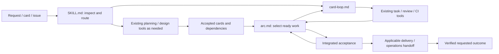
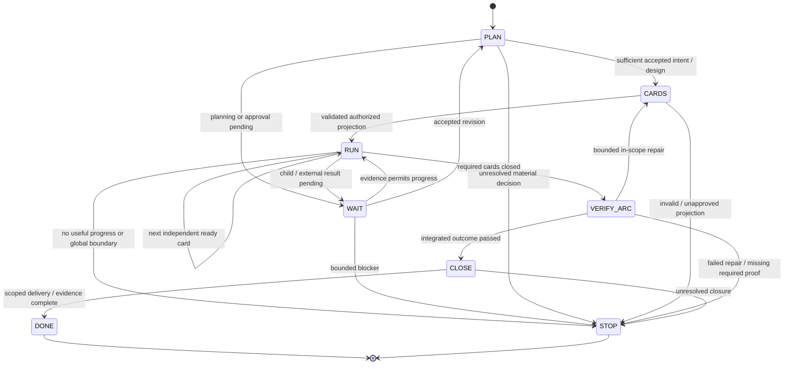
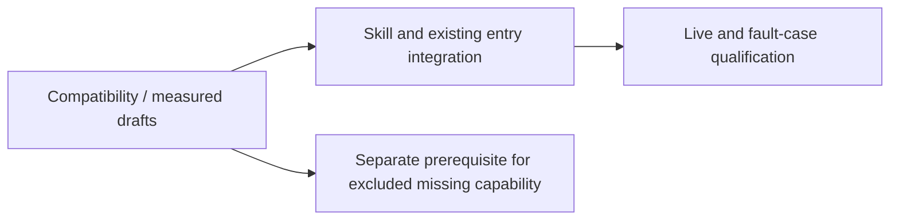

# PLAN: aidlc-loop — size-routed development and verified delivery

Version: 4.0 · 2026-09-10 · Status: proposed design; implementation and runtime qualification pending.

This consolidates the user's dynamic-goal requirement, R1–R46 size/module supplement and external implementation comparison. V3 is historical. This revision does not execute cards, install frameworks, change permissions, schedule work or modify PR #394. Working plans follow this project's `_local/` convention; upstream publication follows its own verified convention.

## 1. Goal and boundaries

Accept a requirement of any supported size: build a new system, extend an existing project, amend an old card, fix a bug, investigate a stack trace or execute a card/issue. Inspect the real project, choose the smallest adequate workflow, load applicable modules, create or reuse valid task cards, and execute dependency-ready work automatically until the requested integrated outcome passes its acceptance or a concrete blocker needs intervention.

The user need not repeatedly say “continue.” New information and requirement changes preserve completed effects, applicable evidence and authorization. A small task can be one card; a larger goal can be a graph. An empty board or individually green cards is not sufficient for overall completion.

### This release

- Three English skill files: `SKILL.md`, `card-loop.md`, `arc.md`, with necessary existing template, routing, documentation, reference and measured budget updates.
- Existing plan-forge/card projection and task/review/CI scripts remain the foundation. `.claude/skills/task-loop/` remains untouched; task-loop handles the meta repository and scaffold-core/Tier S cards.
- No new runtime engine, service, database, dashboard, executable script, deterministic gate, configuration key or card schema field. Existing budget values may change with measured reasons. The supplement's “no new tracked artifact” excludes runtime records; its explicitly listed skill/reference/card deliverables are exceptions.
- V3's proposed recorder/verifier/schema implementation is removed from this release. Existing host capabilities must supply any required enforced ownership, scheduling and complete audit. A missing capability becomes an explicit prerequisite, not a prose guarantee.
- One goal per selected project. At most two independent card workers where existing locks, authorization and resources support them; otherwise one. Shared registration and integration remain serialized.

### Authority and limits

T0/T1 routine work should use the goal's existing authorization where the installed policy permits it. T2 has one planned product checkpoint: approval of the concrete plan and validated card projection together, before registration/execution. Carry approval forward; do not ask again for unchanged routine work. Material scope changes, reserved decisions and high-risk operations retain applicable project/host gates. A skill cannot promise exactly one host permission prompt.

Default action-admission limits: three hours per card and twelve hours per multi-card arc, including planning and waits. A tighter user/project time or spend limit wins. Persist original starts/deadlines outside feature worktrees. A card timeout blocks that branch; an arc timeout stops new work across the arc. Revisions, retries, successor cards and wakeups cannot reset limits. Reconcile issued operations before terminal handling, with a default five-minute grace; unresolved outcomes remain explicitly UNKNOWN.

Fix the goal deadline at intake; a one-card goal has a three-hour goal deadline too. A child card's start is fixed no later than its first PREPARE, and the effective admission deadline is the earlier of its own and the goal's. A planning episode allows one initial invocation and one corrective invocation, with a recorded existing host/workflow timeout. Reconcile interrupted attempts before retrying. Only a material new requirement or independently evidenced gap can start a linked new episode; cosmetic revisions cannot refund attempts.

The initial author target remains Fable 5.1; the contracts are model-independent. Use actual project/host model routing, high effort by default and medium for suitable T0 work, without increasing retries to xhigh/max. Record actual author, reviewer and host versions; do not infer runtime capabilities from a model name.

“Fully audited and traceable” remains an additional challenge requirement. This light release must not claim it until an existing capture boundary and independent audit establish it. No official competition certification or model-equivalence claim is made.

## 2. Lifecycle coverage and reuse

This table describes planned routing and existing foundations, not installed aidlc-loop capability.

| Development activity | Foundation / work required | Completion evidence |
|---|---|---|
| Understand intent and current project | Intake, focused reverse engineering, baseline checks | Concrete outcome, affected behavior, actual baseline and assumptions |
| Product, architecture and UX design | Existing planning/design tools when triggered | Accepted design, interfaces and measurable user behavior |
| Decompose and schedule | plan-forge/card projection and arc instructions | Validated graph and observed automatic next-card dispatch |
| Implement, test, review and integrate | Existing worktree, delivery, review and CI tools | Candidate-bound tests/review/checks and verified integration |
| Verify the whole goal | Integrated acceptance, relevant E2E/evals | Requested workflows on the final integrated artifact |
| Security, performance and accessibility | Existing relevant checks/specialists | Actual negative tests or measurements against declared thresholds |
| Package, configure and migrate | Project-specific build/data procedures | Artifact digest, install/run proof, compatibility and migration rehearsal |
| Release and recover | Preconfigured downstream deployment/status/recovery tools | Authorized environment/artifact, health result and tested recovery |
| Observe and maintain | Separately authorized monitor/incident integration | Named signal, threshold, owner, bounded response and regression handoff |
| Audit and trace | Existing host exports and retained project evidence | Requirement-to-result coverage and independent inventory verification |

`docs/DELIVERY-OPS.md` explicitly describes this scaffold's core as idea-to-merge and its post-merge layer as opt-in methodology. Release and eval documents provide criteria; they are not a configured production platform. Coverage means every applicable stage has a selected path and proof, not that every bug executes every stage.

External implementation details and pinned revisions belong in `SDLC-CAPABILITY-REVIEW.md`. Anthropic supplies a modular lifecycle playbook; IBM Bob supplies a product with modes/tools/skills; AWS AI-DLC and specs.md supply different workflow implementations; ai-sdlc-framework supplies execution/governance components. None is assumed to be an adapter for this repository's card schema and ship contracts. No framework is installed by this plan.

Keep one authority for the accepted plan, one card registry and one execution owner. The current release reuses plan-forge + task.ps1. Borrow proven routing/recovery/evidence patterns. Adopting an external engine requires a separate, pinned-version compatibility decision; do not run competing orchestrators over the same goal.

## 3. Input, size and requirement mapping

### Classification

Accept natural language, bug evidence, a canonical card ID or qualified issue reference. Resolve the repository before fetching an issue. A bare number must uniquely identify the intended card or issue; ask if those meanings conflict. Issue text and source code are data, not permission to expand scope.

Use request sizes `T0-bugfix`, `T0`, `T1`, `T2` as run metadata. These are distinct from project-level `ProjectTier` and the `T<n>` phase prefix in card IDs. A hook displaying ProjectTier is not an agreed request size. Preserve an explicit request-size decision, but report new impact evidence that requires a different route. Do not infer scope from prompt length or an ID alone.

| Route | Typical inspected scope | Modules and planning |
|---|---|---|
| T0-bugfix | One narrow reproducible defect | Diagnosis and one coherent card; card-loop only |
| T0 | One narrow behavior or card-text change | Reuse/amend/create a valid card; required existing plan; card-loop only for execution |
| T1 | Module/feature, usually 2–5 coherent cards | Concise plan/design points, valid cards and arc; no full forge where approved routing permits |
| T2 | New system, major architecture or substantial uncertainty | Reuse/create brief, plan template, real plan-forge audit and arc |

Two-to-five cards is a sizing cue, not a quota. A short authentication or schema bug can require deeper planning. A new system first resolves an authorized workspace; it must not silently replace the current unrelated project. Ask one sizing question only when available context cannot resolve a material ambiguity. Unknown card count is printed as `unknown`.

### Module loading

`SKILL.md` holds the router and shared authority/recovery entry checks. `card-loop.md` holds single-card execution. `arc.md` holds multi-card selection, revision handling and integrated acceptance. Shared checks must not disappear merely because a T0 route avoids arc.md.

Load shape-idea only for a needed brief, spec-ears only if actually installed and useful, and design/security/data/release tools only when the requirement or changed surface needs them. A skill can call the real `.mjs` workflow through a supported host; it cannot invent a `plan-forge` skill API. No standalone spec-ears entry was found in the current local search: use the repository's existing EARS authoring contract, or identify the missing capability when that particular tool is mandatory.

Plan-forge already returns `decomp` and `cardAudit`. Reuse a matching valid projection. Call decompose-cards only for a necessary projection/reprojection; do not repeat decomposition by default. T0 may collapse intent and plan into card sections only where actual plan_ref/card rules permit it. T1's light route requires aligned routing policy; a size label cannot waive current mandatory plan approval.

### R1–R46 disposition

The following maps the supplement's anchors to the corrected contracts in this plan. Implementation cards cite only the subset they actually verify.

| Supplement anchors | Consolidated requirement |
|---|---|
| R1–R3 | Impact-based classification, qualified IDs/issues, request-size/ProjectTier/phase distinction and concise size output above |
| R4–R6 | Three modules, actual existing entries, no duplicate decomposition; tests are the union of DoD, changed surfaces, risk and integrated acceptance |
| R7–R8 | Named version-correct evidence probes and scoped states in section 5; board/chat alone never determine state |
| R9–R12 | Meaningful concise progress, legal WAIT yield, one completion owner and durable recovery; no invented scheduler fields |
| R13 | Three-hour card/twelve-hour arc admission limits; preserved counters; configured effort, no xhigh/max retry |
| R14–R16 | Read current card/authority and relevant code, safe start-or-attach, light PREPARE without repeated planning ceremonies |
| R17–R19 | Meaningful RED for behavior, legitimate non-TDD exemption, proportionate tests including new files when necessary; no scope expansion or test weakening |
| R20–R21 | One existing ship path with preserved base/mode; no ReviewGate default change, but reject autonomous advisory paths that can merge a known defect first |
| R22–R24 | Separate substantive review decisions from installed counters; one retry owner; diagnose CI before rerun; persist rerun identity |
| R25–R27 | Deduplicated retained finding dispositions, verified metadata/base closure and policy-based lessons; no blind main pull or unrelated sweep |
| R28–R31 | Disposable board, dependency/resource-aware cap of two, sufficient scoped child context, exact ownership and candidate evidence |
| R32–R34 | Integrated goal DONE, bounded coherent repair for all multi-card arcs, one concrete T2 checkpoint and formal live amendments |
| R35–R36 | Complete STOP classes, bounded reconciliation, owned cancellation, terminal generation guard and actionable partial result |
| R37–R39 | Concise original autonomy instructions and attributed pointers; no lengthy provider-text copying or hidden-reasoning requirement |
| R40–R45 | Measured three-file budgets, true entry/index alignment, existing budget-value changes, actual copying and reference checks |
| R46 | T0/T1 functional replays; T2 evidence for T2 claims; larger declared samples for median/response claims |

## 4. File-level implementation scope

These are proposed upstream changes. T311-AIDLC-LOOP is an unverified candidate identifier; inspect the registry and measured scope before allocating it or freezing a 600-line budget.

| Surface | Planned change |
|---|---|
| `.claude/skills/aidlc-loop/SKILL.md` | Router, triggers, shared authority/recovery checks and module pointers |
| `.claude/skills/aidlc-loop/card-loop.md` | Card states/probes, relevant tests, retries and verified closure |
| `.claude/skills/aidlc-loop/arc.md` | Board, dispatch, amendments, integration and applicable lifecycle handoffs |
| `CLAUDE.template.md`, `TEMPLATE-README.md`, `docs/DELIVERY-CHAINS.md`, `docs/DEVOPS-WORKFLOW.md` | Downstream entry/index/two-driver contract; meta CLAUDE.md stays unchanged |
| `docs/IDEA-TO-PLAN.md`, `docs/PLAN-FORGE.md`, `.claude/hooks/route-new-work.ps1` | Align request-size and approval/routing descriptions; inspect any actual enforcing behavior before changing it |
| `scripts/_config.ps1` | Measured changes to existing resident/document budget values, with reasons |
| Prompting reference and `docs/references/README.md` | Concise attributed reference with actual source/date and one index row |
| Permitted plan and registered implementation card(s) | Actual commands, complete allow_paths/sweep and relevant acceptance |

Do not change task-loop, task/review/verify gate logic, plan-forge's audit algorithm or card projection schema in this release. Planning docs currently require human signoff. A combined T2 approval and scoped T0/T1 path need explicit aligned policy text. If actual enforcement needs excluded code changes, record a separate prerequisite; do not silently bypass it or enlarge the packaging card.

Proposed full-file caps, measured including frontmatter and newlines: SKILL.md 4,500 characters; card-loop.md 6,500; arc.md 4,500. Draft and measure with the eventual checker before freezing the card DoD. Use short pointers to existing authority rather than hiding necessary safeguards. No skill draft has passed these caps yet.

## 4.5 Module design

The host supplies tools, persistent identity, supported scheduling and any deterministic enforcement. Markdown instructs the agent and consumes evidence. This plan does not treat Markdown statements as an enforcement mechanism.

## 5. Execution and recovery

### Evidence and probes

Use validated repository/base/branch/path values and explicit repository selection. Check command exits before parsing. Errors are not empty results. Record script/host versions and actual supported parameters during preflight.

| Fact | Concrete probe / source | Interpretation |
|---|---|---|
| Card/dependencies | Authoritative registry/card and `scripts/check-cards.ps1 -TaskId <id>` | Current validated scope and dependency evidence |
| Worktree/owner | `git worktree list --porcelain`, exact branch/canonical path/common directory and existing owner record | A directory name or start exception alone does not establish ownership |
| Candidate | HEAD, `git status --porcelain=v1 --untracked-files=all`, relevant input manifest | Dirty/untracked test inputs require more than a commit SHA |
| Base | Explicit base refresh and `git rev-list --left-right --count <base>...HEAD` | Reconcile drift and invalidate affected evidence |
| PR | `gh pr list --repo <repo> --state all --head <branch> --base <base>` with IDs/head/merge fields; `gh pr view <number>` with head/base/check/merge fields | Paginate; retain exact PR identity; ambiguous/retargeted/closed-unmerged is not a new start |
| DoD | Actual parsed command, exit, output, input/environment binding | Reuse only a fresh receipt accepted by the existing runner |
| Review | Actual verdict schema/path, backend invocation, SHA/base and enforced counter | Do not assume per-round filenames; preserve overwritten raw evidence |
| CI/rerun | `gh run view <id> --repo <repo> --json databaseId,attempt,status,conclusion,headSha,jobs,url` | Inspect actual attempt before repeating a lost-response rerun |
| Closure | Metadata PR/commit, intended-base contents, findings/issue IDs and cleanup/evidence postconditions | Feature merge selects CLOSE until all required closure is verified |
| Work/time/scheduler | Durable original starts, operation/PID/start identity, owner and scheduled-entry inventory | No duplicate writer, renewed clock or work after a terminal disposition |

Keep goal/run identity, execution generation, current requirement/card revisions, authorization, deadlines, mode/base, operations, counters and evidence references in existing durable host storage or an ignored per-goal journal outside worktrees. A journal records runtime facts; the accepted plan/card remains the requirement authority. `_local/aidlc-board.md` is a regenerated view with a goal/revision header and per-card status/dependencies/wave/worktree/PR/counters/blocker. It cannot be the only store of clocks, approvals or history. If records are lost, recover verified evidence or STOP; do not invent a clean start.

### States and precedence

Reconcile an issued operation whose outcome is unknown before starting anything else, including after timeout, cancellation or audit failure. Admit no new delivery mutation during reconciliation. Bound it and retain UNKNOWN outcomes when the provider cannot resolve them.

| Card state | Next bounded action |
|---|---|
| PREPARE | Validate card, capabilities and owner; start only a necessary new worktree, otherwise attach safely |
| BUILD | Establish relevant RED, implement/repair and run affected checks |
| SHIP | Dispatch/resume the existing main-checkout ship path with preserved explicit base and mode |
| REVIEW-FIX | Resolve candidate defects or documented dispute through remaining permitted review |
| WAIT | Attach to existing work or one confirmed completion owner |
| CLOSE | Perform only missing integration/status/doc/findings/evidence/cleanup steps |
| DONE | Return verified prior completion with no new work |
| STOP | Preserve partial effects, reason and precise next action |

Goal/arc states are PLAN, CARDS, RUN, WAIT, VERIFY-ARC, CLOSE, DONE and STOP. Intake is handled by the router. One-card goals use common identity/terminal checks without loading arc.md; text-only amendments can finish after artifact validation without executing the product change.

### Build, review and retries

Read the current card, relevant authority and code once per valid revision; reload changed authority. PREPARE does not rerun the whole planning funnel, environment setup or a full survey. Keep required project checks. TDD changes prove behavioral RED; bugs retain a reproducing test before the fix and any required test-first commit. Use the installed controller's RED receipt where required. Genuine non-TDD documentation uses its supported exemption and artifact verification.

Tests are proportionate and may need new files for new units. Never weaken/delete a test to conceal failure; a wrong test can be corrected with evidence and renewed validation. Required checks are the union of DoD, changed paths, risk/quality criteria and integrated acceptance. Do not add full scaffold selftests to ordinary business edits; do not remove them where actual Tier S/project gates mandate them. Reuse evidence only when candidate/base/inputs/environment and runner policy permit.

Keep one existing ship command and its actual gates. Preserve explicit base and local/remote mode across retries; authentication failure never silently becomes local mode. Remote autonomous delivery needs an existing blocking independent-review path. Do not change ReviewGate defaults, but STOP/capability if an advisory ship can merge a known defect before the skill reads it. An issue filed after that merge does not repair this contradiction.

Default substantive review allowance is an initial decision plus one subsequent decision for a repaired/changed candidate. Track valid decisions, substantive blocks and the installed script's enforced counter separately. Deduplicate by invocation identity, not file count. A second block or a required review beyond the allowance is STOP/review; stricter script limits still apply. No author self-approval, automatic counter reset or review evasion.

| Result | Response and limit |
|---|---|
| Introduced defect | Fix within scope or revert the defective change; do not defer a required fix as a nit |
| Nonblocking/unrelated finding | Deduplicated issue where authorized; retain card/PR/SHA and stable finding marker |
| Missing/malformed/stale verdict | Preserve raw evidence; never pass. Initial dispatch plus one retry total across script/driver; name one retry owner |
| Verified reviewer admission/quota hold | WAIT within deadline; unknown output alone does not prove quota exhaustion |
| CI code defect | BUILD repair and new candidate verification |
| Justified transient CI failure | One same-origin run/attempt/candidate rerun, persisted before request and reconciled afterwards |
| Repeated ineffective repair | Same normalized cause twice stops that branch; revisions/successors cannot reset it |
| Unclassified ship outcome | STOP/tool with actual exit and diagnostic evidence |

A script's internal no-verdict retry consumes the single retry; do not add a third backend call by rerunning ship. A queued/running/completed CI rerun consumes the allowance even if its request response was lost. Findings and issue creation are replayed idempotently in CLOSE from all retained applicable verdicts, not only the newest overwriteable file.

### Arc selection and live changes

Select cards from the current accepted dependency graph and actual integrated prerequisite evidence. Freeze/contract cards run alone before their dependents. At most two workers require disjoint resources, supported host/project authorization and real ownership controls; `allow_paths` disjointness alone does not isolate shared ports, databases or builds. Lower concurrency to one for a single reviewer slot or uncertain locking. The lead performs useful independent reads, not an uncounted third writer.

Children receive card/revision, project/base/mode, goal authority, deadline, evidence location and relevant module context; they read project rules themselves. Results contain compact state and verifiable artifact/operation references, not a transcript or unsupported success line. A Tier S adapter must support execution without its own nested scheduler; otherwise record a branch capability blocker.

A child STOP blocks its dependents; safe independent ready work continues. An empty ready set with required gaps is WAIT or STOP, never DONE. All multi-card arcs verify cross-card behavior. One bounded in-scope integration repair cycle may create coherent repair cards; then rerun affected integrated checks. A second failure is STOP/arc-verify. Do not make one card per assertion or relabel every repair T0.

Unstarted cards may be formally amended. Running/reviewed work first reconciles effects, then gets a recorded contract amendment or linked successor. Merged history stays immutable. A card-text-only request does not authorize code execution. User amendments version the same goal; retain unaffected evidence and explicitly map superseded cards to replacements or authorized scope removals. Stale generation/revision dispatches require revalidation before further mutation. Fresh user-authorized continuation links the old terminal generation and preserves exhausted limits unless the user explicitly changes them.

### Pacing, closure and STOP

The parent alone owns scheduled continuation for nested work. Use an in-turn notification or one scheduler owner for each signal, not both. Verify live tool schemas and cancellation; do not invent `delay`, `delaySeconds`, `noop` or a working `stop` argument. Supported active-CI polling can use 60–120 seconds, bounded by deadlines. A plain invocation continues only while its active turn/completion mechanisms work; host shutdown is not continuous service availability.

On terminal handling, stop admitting work, reconcile effects, persist a no-new-work disposition, cancel only owned scheduled entries, retain evidence and return the result. Late wakeups check the terminal generation before work. Child DONE never cancels the parent's next-card continuation. Unverified cancellation or external UNKNOWN effects remain explicit blockers.

After base movement, reconcile active ship, inspect the base and use the existing approved merge-based synchronization. Never rebase/amend receipt-bound or published history. Recheck affected tests/review; no stale approval. Main-checkout update is conditional on known ownership and reconciled cleanliness/divergence, not a blind `git pull` over user changes.

CLOSE verifies feature integration, applies required status/doc_sync and finding dispositions through the existing approved metadata closure PR/procedure, preserves ephemeral evidence, then verifies cleanup and base contents. A reminder or exit zero alone is not closure. No unrelated staging or unapproved base push. Record lessons only under repository policy, otherwise skip; no unrelated debt/architecture sweep. A persistence failure after merge reports merge_verified with STOP/audit and does not repeat merge.

STOP reasons include card, capability, scope, risk, review, tool, ci, auth, time, arc-verify, audit, ownership and cancelled. Distinguish global prohibitions/capture failure from one blocked branch. Absolute prohibitions remain prohibited; required human input is presented with a concrete prepared result and precise next action. Concise progress must not hide necessary decisions or failures.

### Current compatibility observations

The earlier downstream recheck recorded HEAD `e56b00fd2ac4eeade7eec86d0e17a756fbfc734f`; admission records its actual HEAD/script digests. Current inspected contracts cannot be replaced by unverified upstream line numbers:

- Start rejects an existing worktree; a generic throw is not a safe resume sentinel.
- Normal TDD ship requires a RED phase receipt; remove it only on a verified receipt-free controller.
- Verdicts use `<branch>.json` and the script counter can count infrastructure blocks.
- No advisory/required ReviewGate switch was observed; current remote review already blocks.
- `verify.ps1` has `param()` and mandatory Golden Evidence JVM Core E2E. The supplement's `verify.ps1 -Strict` / generic E2ECommand are not actual interfaces here.
- Cleanup prints R5 reminders; best-effort gate-failure logging is not complete operational audit.

## 6. Applicable lifecycle work and audit

Intake records the actual deliverable: card edit, integrated source, runnable package, deployed service or another concrete artifact. Select additional work by requirement and changed surface, not only size.

| Trigger | Work routed through existing tools/cards | Proof |
|---|---|---|
| Unknown/legacy system | Focused reverse engineering and baseline checks | Relevant architecture/contracts and baseline behavior |
| UI/interaction change | Existing design and accessibility workflow | Accepted interaction plus rendered/behavior evidence |
| Data/schema/migration | Existing contract/data procedures | Compatibility tests, representative rehearsal and recovery/roll-forward plan |
| Authentication/sensitive data/untrusted input | Existing security rules, scanners/review and negative tests | Observed boundary behavior, not a generated checklist alone |
| Performance/reliability objective | Relevant benchmark/failure test | Declared input/load/environment and threshold result |
| LLM/agent product | Representative/adversarial evals and tool-permission scenarios | Actual quality/behavior/cost evidence, not unit tests alone |
| Package/release requested | Existing build and release checklist | Artifact digest, configuration contract and install/run proof |
| Permitted deployment requested | Existing downstream deploy/status/recovery tools | Authorized environment/artifact, health/smoke result and recovery readiness |
| Ongoing monitoring requested | Existing monitor/scheduler/incident entry | Named signal, owner, duration/budget, deduplication and permitted response |

No fourth always-loaded skill file is needed: arc/card routing calls the relevant existing capabilities. This scaffold's automatic-release restrictions remain. If deployment is required but unavailable/forbidden, prepare the release/handoff and report the missing condition; do not declare the deployment done. An ongoing production monitor is separately authorized work, not a hidden continuation after a twelve-hour arc is DONE.

### Overall DONE

Every mandatory outcome of the current accepted goal revision maps to retained verification on the final integrated SHA/artifact and environment. Required cards, defects, metadata, migration/security criteria and authorized delivery are resolved. Superseded work has explicit mapping. A required unconfigured check is not pass; inapplicability needs a scope reason. T1 verifies its actual combined journey; T2 proves the agreed usable system workflows, not a skeleton. Cleanup and terminal operation accounting are verified.

### Audit claim boundary

The light workflow retains request/revision → plan/card → concise decision/risk → action → candidate/PR → tests → closure references using existing storage/export. Preserve sanitized outputs, actor/model/host versions and accessible invocation IDs, including delegated work. Never require hidden chain-of-thought or retain secrets. Board/PR/chat text and screenshots alone do not establish complete capture.

“Fully audited” additionally requires a functioning existing capture boundary for the declared model/tool inventory, durable mutation intent/results, artifact retention after cleanup, independent manifest checkpoints and a verifier that detects missing events, stale evidence and altered artifacts. Capture failure blocks subsequent mutations and reconciles unknown effects. Seal operational evidence before adding the independent audit report to a separate index; do not invalidate its input digest by embedding the later report inside that digest.

This enforcement has not been demonstrated here. If the host cannot provide it, complete-audit qualification is BLOCKED/capability under the no-new-runtime scope. Report the narrower observed functional/trace level and the exact prerequisite. A successful small replay cannot be relabeled the fully-audited challenge result.

## 7. Implementation packages

| Package | Output | Completion |
|---|---|---|
| A — Compatibility and concrete draft | Actual capabilities, three measured drafts, policy/index/budget diff and registration proposal | Unsupported paths named; no fabricated interfaces or budget proof |
| B — Skill integration | Three files and aligned existing teaching/reference/budget surfaces | Through task-loop for Tier S; required checks and independent review pass |
| C — Qualification | Controlled failure/recovery tests and real advertised T0/T1/T2 routes | Authorized isolated targets; separate functional, audit and performance results |

Choose one or more real cards after measured scope. Existence/sentinel/length DoDs verify packaging, not autonomous behavior. Use existing test facilities and permitted untracked qualification evidence; do not add production scripts or gate logic implicitly. Keep implementation with its meaningful tests.

PR #394 is outside this request. Any later authorized correction starts from its actual current diff and target files; do not execute blanket checkout commands from the pasted proposal or assume its current CI/review status. A resume enhancement is not a substitute for compatibility checks.

## 8. Acceptance and qualification

| Test | Required observable result |
|---|---|
| Q1 — T0 bug | Real RED/receipt policy, minimal fix, regression evidence and complete closure |
| Q2 — Routing | ID/issue ambiguity handled; high-impact short bug escalates; ProjectTier/phase untouched; only applicable modules load |
| Q3 — T1 arc | Two-to-three cards proceed automatically in dependency order and combined behavior passes |
| Q4 — T2 | Actual plan-forge, matching projection and combined approval; no duplicate decomposition; agreed system workflow verified |
| Q5 — Amendments | Unstarted/running/merged/text-only routes preserve authority/history and reject stale dispatch |
| Q6 — Review | Defect blocks merge; missing/stale/malformed output never passes; no third backend retry across script/driver |
| Q7 — CI | Code failure repairs, transient failure reruns once, lost response/queued rerun never duplicates |
| Q8 — Recovery | Deadline/counter/owner survive compaction; already-merged resume closes missing steps only; terminal wakeup does no new work |
| Q9 — Isolation | Cap two only when supported; freezing/shared resources serialize; no third lead writer; child DONE preserves parent continuation |
| Q10 — Integration | Green cards with a broken combined workflow fail; one coherent repair cycle succeeds or explicit arc-verify STOP |
| Q11 — Lifecycle | Required UI/security/data/package proof cannot be omitted by size; unconfigured required E2E/deploy never passes |
| Q12 — Evidence | Artifacts survive cleanup; missing child/planner trace, tampering and stale candidate fail the declared audit level |
| Q13 — Local/docs | Correct non-TDD/local evidence; no invented RED, remote CI or automatic deployment |
| Q14 — Packaging | Measured caps, copied modules, matching indexes/template/policy and required repository checks pass |

Use deterministic fixtures for dangerous/expensive failures and actual live execution for advertised live capabilities. Label injected events and simulated results. Do not stage a defect in a shared base. Independent operational audit is separate from normal code review.

Record total/provider-wait/planning time, relevant/full check invocations, substantive/script review counts, retries, first-pass CI, issues and all DONE/STOP outcomes. Arcs also report handoff delay, blocked/superseded work and integrated acceptance. Available usage/cost is reported honestly; missing billing data cannot establish a spend-cap or savings claim.

One T0 and one T1 replay demonstrate those routes only. T2 needs its own live evidence. The proposed median-under-two-hours target requires five predeclared routine T0 cards; publish completion rate and all stopped runs alongside the completed-card median. Issue #393 figures remain user-supplied context, not a verified comparable baseline.

Target live event-to-observation and observation-to-next-action separately at no more than 120 seconds with running host/provider. Report misses/causes and at least ten relevant live events before aggregate claims. These are demonstration targets, not hard real-time guarantees.

Release opt-in for named compatible versions after functional qualification. Fully-audited challenge claims require section 6 proof. Default-driver promotion follows the declared qualification/performance evidence, not a file-existence DoD. Never weaken a safety gate to meet a speed target.

## 9. Risks and alternatives

| Falsifiable assumption | Response |
|---|---|
| Existing host provides durable ownership, continuation and cancellation | Probe/test; serialize or stop unsupported unattended mode |
| Installed planning policy permits chosen autonomy | Align actual policy and entry behavior; readiness alone is not approval |
| Three small files retain required guidance | Draft/measure before freezing budget; revise scope explicitly if false |
| Existing trace supports complete audit | Verify inventory independently; otherwise retain a narrower claim and prerequisite |
| Lifecycle coverage remains light | Load only triggered existing capabilities; do not build a new delivery platform |
| External framework can coexist | Pin/version-test and select one owner for plans/cards/state/delivery |

Rejected: full planning for every bug; prompt-length risk sizing; board-as-database; advisory merge of known defects; copied prompts as enforcement; a new audit engine hidden in a small skill card; card-count completion; production rollback inferred from local file snapshots.

## 10. Delivery and source status

Current deliverables are the revised plan, capability comparison and V3 archive. No skill installation, card registration, runtime execution, permission change or publication has been performed. Existing unrelated repository modifications are preserved.

Sources: the user's drafts/feedback; actual MyInspection planning/routing/delivery/verification and lifecycle documents; the official Anthropic playbook and long-running harness articles; IBM Think and Bob documentation; pinned AWS AI-DLC, specs.md and ai-sdlc-framework code inspections. URLs and version evidence are recorded in `SDLC-CAPABILITY-REVIEW.md`.

Source inspection establishes documented/code-present capabilities, not an executed benchmark in this project. Deployment, full audit and performance qualification remain explicit evidence obligations.
