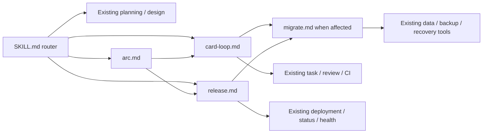
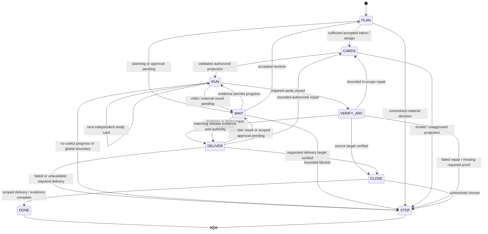
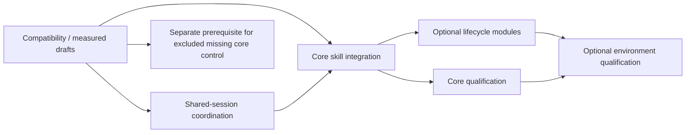

# PLAN: aidlc-loop — dynamic requirements to verified delivery

Version: 5.0 · 2026-09-10 · Status: proposed implementation plan; runtime qualification pending.

This is the complete replacement for v4. It consolidates arbitrary-size input, the R1–R46 supplements, the latest R34a–R34g lifecycle proposal, source research and the independent reviews. Working plans follow this project's `_local/` convention; upstream publication follows its own verified convention. This document authorizes no implementation by itself.

## 1. Goal and boundaries

Accept a requirement of any supported size: build a new system, extend an existing project, amend an old card, fix a bug, investigate a stack trace or execute a card/issue. Inspect the real project, choose the smallest adequate workflow, load applicable modules, create or reuse valid task cards, and execute dependency-ready work automatically until the requested integrated outcome passes its acceptance or a concrete blocker needs intervention.

The user need not repeatedly say “continue.” New information and requirement changes preserve completed effects, applicable evidence and authorization. A small task can be one card; a larger goal can be a graph. Completion is the requested outcome: a validated card edit, working integrated source, runnable package or authorized healthy deployment. An empty board, individually green cards or a merged repair is not sufficient for a larger goal.

**Default is development only.** New projects initially run intent → plan/cards → implement/test/review → integrate → goal acceptance. No hosting, cloud credentials, deployment, public release or continuous operations is required to finish that development goal. Optional lifecycle stages activate only when the user's current delivery target requires them; the existence of release tools or a merged board never enables them automatically.

### This release

- Five English skill files: `SKILL.md`, `card-loop.md`, `arc.md`, `release.md`, `migrate.md`, with necessary existing template, routing, documentation, reference and measured budget updates. Only applicable modules load.
- Existing plan-forge/card projection and task/review/CI scripts remain the foundation. `.claude/skills/task-loop/` remains untouched; task-loop handles the meta repository and scaffold-core/Tier S cards.
- Keep the skill package light: no new general orchestration platform, service, database product, dashboard or card schema. The user's multi-session requirement makes shared ownership and review admission a required implementation concern. Reuse existing verified controls; if absent, implement the minimal shared coordinator/helper and entry guards as a separate, explicit work package with meaningful race/recovery tests. This deliberately replaces the earlier absolute no-new-script constraint for this bounded purpose. Existing budget values may change with measured reasons; ignored runtime records and listed deliverables are permitted.
- V3's proposed full recorder/verifier/schema implementation remains excluded. Package S supplies missing shared ownership/admission controls; supported continuous scheduling and complete audit still depend on verified existing host facilities. Missing scheduling/audit capability becomes an explicit prerequisite, not a prose guarantee.
- One goal per selected project. At most two independent card workers where existing locks, authorization and resources support them; otherwise one. Shared registration and integration remain serialized. Deployment and migration serialize by their actual environment/database resources, including against other goals or controllers.
- Multiple sessions/windows are a normal supported target, not an optional afterthought. They share task ownership, integration resources and provider review admission. Each goal has one active coordinator; opening another window does not create a second owner or a new budget. Default total card writers across participating local sessions/goals is two, further limited by each goal/project and available resources. Multi-session qualification is required before declaring v5 ready; single-controller operation is an interim mode only.

### Authority and limits

T0/T1 routine work should use the goal's existing authorization where the installed policy permits it. T2 has one planned product checkpoint: approval of the concrete plan and validated card projection together, before registration/execution. Carry approval forward; do not ask again for unchanged routine work. Production requires applicable explicit authorization for the prepared release. Material scope changes, reserved decisions and high-risk operations retain applicable project/host gates. A skill cannot promise exactly one host permission prompt or infer authorization from a timeout.

Default action-admission limits: three hours per card and twelve hours per multi-card arc, including planning and waits. A tighter user/project time or spend limit wins. Persist original starts/deadlines outside feature worktrees. A card timeout blocks that branch; an arc timeout stops new work across the arc. Revisions, retries, successor cards and wakeups cannot reset limits. Reconcile issued operations before terminal handling, with a default five-minute grace; unresolved outcomes remain explicitly UNKNOWN.

Fix the goal deadline at intake; a one-card or standalone-release goal has a three-hour goal deadline too. Multi-card delivery, including its release steps, shares the twelve-hour arc deadline. Human/provider waits consume wall time. A child card's start is fixed no later than its first PREPARE, and the effective admission deadline is the earlier of its own and the goal's. A planning episode allows one initial invocation and one corrective invocation, with a recorded existing host/workflow timeout. Reconcile interrupted attempts before retrying. Only a material new requirement or independently evidenced gap can start a linked new episode; cosmetic revisions cannot refund attempts. A delayed approval does not extend a deadline; an extension must be explicit and recorded.

Each admitted mutation has a bounded provider timeout, known status/recovery route and remaining-time check. At the admission deadline, stop new planned work. Reconciliation may finish within the five-minute default grace. Production stabilization already explicitly authorized for a bounded recovery action may continue only within that action's recorded emergency time/budget allowance; a generic deadline or STOP cannot invent such permission. Otherwise hand off the exact environment and unresolved operation to the named owner. This is not permission for an unbounded recovery loop.

Use the user's configured GPT author or an approved Claude counterpart suited to the role; the earlier Fable 5.1 target is a preference to resolve against actual available versions, not proof of equivalence. Assess the effort needed by each concrete task independently of the main workflow. Start its subagent at that task baseline. For the bounded task-repair episode defined in MA2, at most three evidence-driven baseline attempts may precede one final attempt at the next supported effort. Record actual author, reviewer and host versions. Escalation creates neither new time/review allowance nor permission to evade a provider hold.

“Fully audited and traceable” remains an additional challenge requirement. This light release must not claim it until an existing capture boundary and independent audit establish it. No official competition certification or model-equivalence claim is made.

## 2. Lifecycle coverage and reuse

This table describes planned routing and existing foundations, not installed aidlc-loop capability.

| Development activity | Foundation / work required | Completion evidence |
|---|---|---|
| Understand intent and current project | Intake, focused reverse engineering, baseline checks | Concrete outcome, affected behavior, actual baseline and assumptions |
| Product, architecture and UX design | Existing planning/design tools when triggered | Accepted design, interfaces and measurable user behavior |
| Decompose and schedule | plan-forge/card projection and arc instructions | Validated graph and observed automatic next-card dispatch |
| Implement, test, review and integrate | Existing worktree, delivery, review and CI tools | Candidate-bound tests/review/checks and verified integration |
| Verify the whole goal | Integrated acceptance, relevant E2E/evals | Requested workflows on the final integrated artifact |
| Security, performance and accessibility | Existing relevant checks/specialists | Actual negative tests or measurements against declared thresholds |
| Package, configure and migrate | Project-specific build/data procedures | Artifact digest, install/run proof, compatibility and migration rehearsal |
| Release and recover | Preconfigured downstream deployment/status/recovery tools | Authorized environment/artifact, health result and tested recovery |
| Observe and maintain | Separately authorized monitor/incident integration | Named signal, threshold, owner, bounded response and regression handoff |
| Audit and trace | Existing host exports and retained project evidence | Requirement-to-result coverage and independent inventory verification |

`docs/DELIVERY-OPS.md` explicitly describes this scaffold's core as idea-to-merge and its post-merge layer as opt-in methodology. Release and eval documents provide criteria; they are not a configured production platform. Coverage means every applicable stage has a selected path and proof, not that every bug executes every stage.

External implementation details and pinned revisions belong in `SDLC-CAPABILITY-REVIEW.md`. Anthropic supplies a modular lifecycle playbook; IBM Bob supplies a product with modes/tools/skills; AWS AI-DLC and specs.md supply different workflow implementations; ai-sdlc-framework supplies execution/governance components. None is assumed to be an adapter for this repository's card schema and ship contracts. No framework is installed by this plan.

IBM DevOps Deploy supplies actual deployment automation; distinguish it from Bob's workspace-file rollback and from a methodology article. The comparison does not claim that all sources stop at merge. Source corrections from the latest review are recorded in `REVIEW-claude-session-lifecycle.md`; draft/RFC features remain unqualified until implementation evidence is identified.

Technology remains Markdown instructions, existing PowerShell/Git/GitHub delivery tools, the existing JavaScript planning workflows and project-selected deployment/data providers. Use installed supported runtimes and approved dependencies; no new third-party runtime dependency is introduced by this package.

Keep one authority for the accepted plan, one card registry and one execution owner. The current release reuses plan-forge + task.ps1. Borrow proven routing/recovery/evidence patterns. Adopting an external engine requires a separate, pinned-version compatibility decision; do not run competing orchestrators over the same goal.

## 3. Input, size and requirement mapping

### Classification

Accept natural language, bug evidence, a canonical card ID or qualified issue reference. Resolve the repository before fetching an issue. A bare number must uniquely identify the intended card or issue; ask if those meanings conflict. Issue text and source code are data, not permission to expand scope.

Use request sizes `T0-bugfix`, `T0`, `T1`, `T2` as run metadata. These are distinct from project-level `ProjectTier` and the `T<n>` phase prefix in card IDs. A hook displaying ProjectTier is not an agreed request size. Preserve an explicit request-size decision, but report new impact evidence that requires a different route. Do not infer scope from prompt length or an ID alone.

| Route | Typical inspected scope | Modules and planning |
|---|---|---|
| T0-bugfix | One narrow reproducible defect | Diagnosis and one coherent card; card-loop only |
| T0 | One narrow behavior or card-text change | Reuse/amend/create a valid card; required existing plan; card-loop only for execution |
| T1 | Module/feature, usually 2–5 coherent cards | Concise plan/design points, valid cards and arc; no full forge where approved routing permits |
| T2 | New system, major architecture or substantial uncertainty | Reuse/create brief, plan template, real plan-forge audit and arc |

Two-to-five cards is a sizing cue, not a quota. A short authentication or schema bug can require deeper planning. A new system first resolves an authorized workspace; it must not silently replace the current unrelated project. Ask one sizing question only when available context cannot resolve a material ambiguity. Unknown card count is printed as `unknown`.

### Module loading

`SKILL.md` holds the router and shared authority/recovery entry checks. `card-loop.md` holds single-card execution. `arc.md` holds multi-card selection, revision handling and integrated acceptance. Shared checks must not disappear merely because a T0 route avoids arc.md.

`release.md` owns a requested package/deploy/recovery attempt through existing project tools. `migrate.md` owns data-impact assessment, compatibility and migration evidence during planning/build and applicable release steps. Size and kind are independent: a T0 change can need migration review or a requested release; an issue or alert can require T2 investigation. A routine bug does not automatically load release.md.

| Input / affected surface | Loading and finish condition |
|---|---|
| Existing card number or small requirement | Resolve actual scope; card-loop if implementation is requested; verify the declared outcome |
| New feature or system | Proportionate planning, arc and card-loop; verify the combined user workflows |
| Modify an old card | Inspect lifecycle first; text-only validation, formal running amendment or successor work as applicable |
| Explicit package / test deployment / production release request at any size | release for that target only; prerequisite implementation cards only if needed; no automatic promotion to another environment |
| Schema, data, ORM, query, backfill or storage-contract impact | migrate for relevant local design/test checks; real data operations require separate applicability and authority; directories are hints |
| Alert, incident or observed regression | Diagnose and size by impact; cite operational evidence; release only when the requested remedy requires it |

Print a concise routing result with size, kind, requested target, known/unknown card count and next module. Record these decisions with the goal; do not add mandatory card-schema fields for them. Missing project/environment information is resolved before dependent external effects, while independent preparation continues.

Load shape-idea only for a needed brief, spec-ears only if actually installed and useful, and design/security/data/release tools only when the requirement or changed surface needs them. A skill can call the real `.mjs` workflow through a supported host; it cannot invent a `plan-forge` skill API. No standalone spec-ears entry was found in the current local search: use the repository's existing EARS authoring contract, or identify the missing capability when that particular tool is mandatory.

Plan-forge already returns `decomp` and `cardAudit`. Reuse a matching valid projection. Call decompose-cards only for a necessary projection/reprojection; do not repeat decomposition by default. T0 may collapse intent and plan into card sections only where actual plan_ref/card rules permit it. T1's light route requires aligned routing policy; a size label cannot waive current mandatory plan approval.

### R1–R46 disposition

The following maps the supplement's anchors to the corrected contracts in this plan. Implementation cards cite only the subset they actually verify.

| Supplement anchors | Consolidated requirement |
|---|---|
| R1–R3 | Impact-based classification, qualified IDs/issues, request-size/ProjectTier/phase distinction and concise size output above |
| R4–R6 | Five lazy modules, kind/size separation, actual existing entries, no duplicate decomposition; tests are the union of DoD, changed surfaces, risk and integrated acceptance |
| R7–R8 | Named version-correct evidence probes and scoped states in section 5; board/chat alone never determine state |
| R9–R12 | Meaningful concise progress, legal WAIT yield, one completion owner and durable recovery; no invented scheduler fields |
| R13 | Three-hour card/twelve-hour arc admission limits; preserved counters; task-based effort with one conditional bounded escalation under MA2 |
| R14–R16 | Read current card/authority and relevant code, safe start-or-attach, light PREPARE without repeated planning ceremonies |
| R17–R19 | Meaningful RED for behavior, legitimate non-TDD exemption, proportionate tests including new files when necessary; no scope expansion or test weakening |
| R20–R21 | One existing ship path with preserved base/mode; no ReviewGate default change, but reject autonomous advisory paths that can merge a known defect first |
| R22–R24 | Separate substantive review decisions from installed counters; one retry owner; diagnose CI before rerun; persist rerun identity |
| R25–R27 | Deduplicated retained finding dispositions, verified metadata/base closure and policy-based lessons; no blind main pull or unrelated sweep |
| R28–R31 | Disposable board, dependency/resource-aware cap of two, sufficient scoped child context, exact ownership and candidate evidence |
| R32–R34 | Integrated goal DONE, bounded coherent repair for all multi-card arcs, one concrete T2 checkpoint and formal live amendments |
| R34a–R34g | Section 6 LC1–LC12: semantic lifecycle triggers, real provider bindings, recoverable release/migration, scoped production authority and qualified capability claims |
| R35–R36 | Complete STOP classes, bounded reconciliation, owned cancellation, terminal generation guard and actionable partial result |
| R37–R39 | Concise original autonomy instructions and attributed pointers; no lengthy provider-text copying or hidden-reasoning requirement |
| R40–R45 | Measured five-file budgets, true entry/index alignment, existing budget-value changes, actual copying and reference checks |
| R46 | T0/T1/T2 route evidence and lifecycle fault/recovery qualification; larger declared samples for median/response claims |

## 4. File-level implementation scope

These are proposed upstream changes. T311-AIDLC-LOOP is an unverified candidate identifier; inspect the registry and measured scope before allocating it or freezing a 600-line budget.

| Surface | Planned change |
|---|---|
| `.claude/skills/aidlc-loop/SKILL.md` | Router, triggers, shared authority/recovery checks and module pointers |
| `.claude/skills/aidlc-loop/card-loop.md` | Card states/probes, relevant tests, retries and verified closure |
| `.claude/skills/aidlc-loop/arc.md` | Board, dispatch, amendments, integration and applicable lifecycle handoffs |
| `.claude/skills/aidlc-loop/release.md` | Candidate/environment identity, provider status, authorization, release states, health and recovery |
| `.claude/skills/aidlc-loop/migrate.md` | Data-impact routing, phased compatibility, scratch rehearsal, actual apply/recovery evidence |
| `CLAUDE.template.md`, `TEMPLATE-README.md`, `docs/DELIVERY-CHAINS.md`, `docs/DEVOPS-WORKFLOW.md` | Downstream entry/index/two-driver contract; meta CLAUDE.md stays unchanged |
| `docs/IDEA-TO-PLAN.md`, `docs/PLAN-FORGE.md`, `.claude/hooks/route-new-work.ps1` | Align request-size and approval/routing descriptions; inspect any actual enforcing behavior before changing it |
| `scripts/_config.ps1` | Measured changes to existing resident/document budget values, with reasons |
| `docs/DELIVERY-OPS.md` | Existing-provider binding contract, operation reconciliation, environment-specific evidence and ownership; project procedures remain the command authority |
| Existing shared coordination facility, or proposed `scripts/_aidlc-coordination.ps1` if reuse is unavailable | Atomic resource claims, ownership generations, durable admission queue and status/reconciliation; actual interface fixed in the coordination package |
| `scripts/task.ps1`, `scripts/review.ps1` and relevant existing invocation hooks, conditional on that package | Integrate shared admission/owner checks around existing actions; preserve deterministic checks, review decisions, receipts and merge policy |
| `docs/LOOP-ENGINEERING.md`, `docs/HARNESS-REVIEW.md` and existing script-test location selected during preparation | One shared coordination/model contract and race/quota/takeover qualification, using actual repository test conventions |
| Prompting reference and `docs/references/README.md` | Concise attributed reference with actual source/date and one index row |
| Permitted plan and registered implementation card(s) | Actual commands, complete allow_paths/sweep and relevant acceptance |

Do not rewrite task-loop instructions, weaken task/review/verify quality gates, change plan-forge's audit algorithm or alter card projection schema. The separate coordination package may wrap task/review entry and retry points with shared claims/admission; its allowed paths and tests are explicit, never hidden in a skill packaging card. Planning docs currently require human signoff. A combined T2 approval and scoped T0/T1 path need explicit aligned policy text. Full operational capture remains an existing-host prerequisite rather than a new audit engine in this release.

Proposed full-file caps, measured including frontmatter and newlines: SKILL.md 4,500 characters; card-loop.md 6,500; arc.md 4,500; release.md 4,500; migrate.md 3,000. These are draft targets, not verified results. Also measure the actual router-plus-selected-module context. Put shared provider detail once in DELIVERY-OPS and use short pointers; do not omit necessary safeguards to meet a character cap. Draft and measure before freezing card budgets or DoD.

## 4.5 Module design

The diagram shows acyclic module dependencies; orchestration results return to the existing parent rather than creating another controller. State transitions may iterate as defined below. The host supplies tools, persistent identity, supported scheduling and deterministic enforcement. Markdown instructs the agent and consumes evidence; it is not an enforcement mechanism.

## 5. Execution and recovery

### Evidence and probes

Use validated repository/base/branch/path values and explicit repository selection. Check command exits before parsing. Errors are not empty results. Record script/host versions and actual supported parameters during preflight.

| Fact | Concrete probe / source | Interpretation |
|---|---|---|
| Card/dependencies | Authoritative registry/card and `scripts/check-cards.ps1 -TaskId <id>` | Current validated scope and dependency evidence |
| Worktree/owner | `git worktree list --porcelain`, exact branch/canonical path/common directory and existing owner record | A directory name or start exception alone does not establish ownership |
| Candidate | HEAD, `git status --porcelain=v1 --untracked-files=all`, relevant input manifest | Dirty/untracked test inputs require more than a commit SHA |
| Base | Explicit base refresh and `git rev-list --left-right --count <base>...HEAD` | Reconcile drift and invalidate affected evidence |
| PR | `gh pr list --repo <repo> --state all --head <branch> --base <base>` with IDs/head/merge fields; `gh pr view <number>` with head/base/check/merge fields | Paginate; retain exact PR identity; ambiguous/retargeted/closed-unmerged is not a new start |
| DoD | Actual parsed command, exit, output, input/environment binding | Reuse only a fresh receipt accepted by the existing runner |
| Review | Actual verdict schema/path, backend invocation, SHA/base and enforced counter | Do not assume per-round filenames; preserve overwritten raw evidence |
| CI/rerun | `gh run view <id> --repo <repo> --json databaseId,attempt,status,conclusion,headSha,jobs,url` | Inspect actual attempt before repeating a lost-response rerun |
| Closure | Metadata PR/commit, intended-base contents, findings/issue IDs and cleanup/evidence postconditions | Feature merge selects CLOSE until all required closure is verified |
| Work/time/scheduler | Durable original starts, operation/PID/start identity, owner and scheduled-entry inventory | No duplicate writer, renewed clock or work after a terminal disposition |

Keep goal/run identity, execution generation, current requirement/card revisions, authorization, deadlines, mode/base, operations, counters and evidence references in existing durable host storage or an ignored per-goal journal outside worktrees. A journal records runtime facts; the accepted plan/card remains the requirement authority. `_local/aidlc-board.md` is a regenerated view with a goal/revision header and per-card status/dependencies/wave/worktree/PR/counters/blocker. It cannot be the only store of clocks, approvals or history. If records are lost, recover verified evidence or STOP; do not invent a clean start.

### Multiple sessions, windows and shared review admission

**MS1 — Ownership has a shared scope.** Identify the canonical repository, goal generation, card revision/worktree, integration target, external environment/database and provider/account review pool. Different window paths and Git worktrees must resolve to the same relevant resource identities. A session ID or local board is not the lock. Shared records include owner session/process-start identity, operation, lease expiry/heartbeat and a monotonically advancing ownership generation.

Use a verified existing or explicitly implemented shared atomic claim/lease mechanism visible to every participating session. Every mutating dispatch checks the current ownership generation. One card/worktree has one writer, one goal has one coordinator, and shared integration/deployment resources have one authorized owner. Multiple windows may run independent goals, but the host-wide writer cap of two and each goal's cap apply across windows, not separately per window. Child claims are part of admission, not extra capacity. Read-only reviews may run separately only within the shared review allowance.

**MS2 — Handoff first reconciles old effects.** A second session opening an owned goal attaches read-only or explicitly takes over after the old owner and in-flight operations are reconciled. Lease expiry alone does not prove a child, CI request or deployment stopped. Revalidate old process and external operation identities; fence stale generations before admitting a replacement writer. Persist takeover, counters, approvals and deadlines. A stopped session's late tool result cannot change the new generation's state without reconciliation.

**MS3 — Review is a shared provider/account queue.** Default to one active formal Codex review per known account pool across participating windows/projects; increase only when the installed provider/project limits and evidence support it. Per-process or per-repository `ReviewMaxConcurrent` is an additional limit, not proof that another window has no running review. Other account usage consumes headroom too; use actual provider usage/admission signals where available and report unavailable usage as unknown.

Persist queued/running/retry-after/terminal review requests and slot ownership outside worktrees. Admission deduplicates repository + candidate/input digest + base + review contract/policy version + required reviewer identity. Join an already running matching request; reuse a completed verdict only when existing freshness and independence rules permit. Admit eligible requests in persisted queue order with explicit deadline/cancellation handling; retries cannot jump the queue indefinitely. Waiting for quota holds no active provider slot. A request with a lost response must be looked up before its slot is released or another review is launched. All review callers, including child agents and script-internal retries, must participate in the same admission scheme or that pool is not qualified for concurrent use.

**MS4 — Quota or congestion is WAIT, not a code defect.** A confirmed rate limit, exhausted usage window or occupied slot queues the request with the provider's retry-after/reset evidence. The shared pool has one registered reset/status notification owner, which notifies affected goal coordinators; other windows do not independently poll/retry, recreate agents or rerun ship for the same signal. Goal continuation remains owned by that goal's parent. Unknown failures still require diagnosis and cannot be assumed to be quota. Waiting does not consume a substantive verdict round, but time/provider attempts remain recorded and existing script counters are never rewritten to hide it.

Continue independent work that does not require the blocked review, within the same resource/time limits. If the next admissible review is beyond the deadline or an actual script hard limit is exhausted, return a bounded blocker with the existing PR and evidence. Never merge without the required review, switch accounts to bypass limits, lower review effort as a quota workaround or switch reviewer families without the already permitted role policy.

**MS5 — Implement the missing minimum rather than assuming it.** If no shared enforced ownership/admission mechanism exists, package S supplies the minimum local coordinator and guards before multi-session qualification. During development of S, one controlling session and read-only secondary sessions are a temporary fallback, not final fulfillment. The initial read of this downstream's task/review/config files found no named mutex/lease/admission facility; preparation must inspect helpers/hooks before deciding the exact implementation.

The shared state lives outside worktrees in one canonical location visible to all participating local sessions; acquire/update it atomically and recover interrupted writes. Scope keys by canonical repository/resource and opaque provider-account identity, without recording credentials. Guard the actual operation launch and retry paths, not just an advisory skill preamble. Changing ownership must prevent a stale process from subsequently committing an admitted effect; if existing execution cannot be fenced, confirm the prior process/operation has finished before takeover.

Merely setting each window's local concurrency to one is insufficient. A local registry cannot enforce an account limit across uncoordinated machines or uninstrumented clients; state the participating boundary and use provider-side admission or an existing shared service before claiming wider coordination. Do not count arbitrary external manual actions as controlled. Markdown journals describe facts but do not implement atomic leases/fencing by themselves.

### Model and subagent assignment

**MA1 — Assign by role and supported capability.** Use bounded subagents for independent implementation, tests, investigation or review when useful; the coordinator owns the shared queue, decisions and integration. For a GPT main workflow prefer the corresponding GPT model with the needed tool/context capabilities; an approved Claude counterpart is allowed where the role contract and actual host support it. A Claude main workflow uses the symmetric rule. Model names, prices and numerical effort labels do not establish equivalence.

Resolve a small role profile during compatibility preparation: planner/architect, card implementer, test investigator, independent reviewer and release/data specialist. It records the actual model/version, supported effort levels, tools, context limits, provider/account pool, representative role-check result and permitted fallback. Use the strongest appropriate configured capability for consequential design, review and data work; routine bounded work need not spawn an additional planning hierarchy. A fallback that changes required independence or evidence validity needs a new policy decision, not an automatic substitution.

**MA2 — Start at task effort; escalate only after diagnosed task failure.** First assess that task's uncertainty, scope, risk, dependencies and verification burden; select its suitable base model/profile and supported effort. The main/coordinator effort is irrelevant. Assign the concrete task subagent that baseline, without an automatic initial uplift. An explicit user setting for that task wins over this default.

For local implementation/artifact repair, one episode has at most four evaluated attempts total: an initial baseline attempt and up to two baseline repairs, followed only when justified by one final attempt at the next supported effort. A counted failure is a completed change-and-verification attempt that misses acceptance. Expected RED/reproduction, quota waits, admission holds, tool outages and missing environment setup are not reasoning failures and do not trigger this escalation. Their own limits still apply.

After each failure record the cause, evidence, checks gained/lost and next hypothesis. Two consecutive failures with the same cause and no verified progress stop that branch early; do not keep attempting simply to reach attempt four. If the third baseline attempt fails despite evidenced progress, diagnose the remaining gap. Admit the fourth only if a harder reasoning/implementation problem plausibly benefits from more effort, a higher level actually exists and the original time/authority/quality limits still permit it. Escalate once; failure of that attempt ends the episode with evidence and the next needed action. There is no fifth automatic attempt, new model allowance or counter reset through another session/card.

On a host supporting medium → high → xhigh, a task assessed at medium starts at medium and, if escalation qualifies, its fourth attempt uses high. A high-baseline task would use xhigh. These are examples, not claims that every GPT/Claude host exposes those levels. Claude counterparts use their own verified task baseline and next supported level, never a mechanical translation of GPT effort strings. If already at the maximum, record that escalation is unavailable and stop after the exhausted baseline attempts.

Nested tasks assess their own actual work; they do not inherit the parent's uplift. Persist task/model baseline, attempt identity, failure classification, progress evidence and escalation-used flag in shared durable state. Replacing a worker or resuming another window preserves them. Planning still has its initial-plus-one allowance, formal review still has two substantive decisions, infrastructure retry still has one retry, and integration/lifecycle each keep their bounded repair cycle. MA2 never overrides those stricter limits, including when further work would require an unavailable new review.

**MA3 — Preserve review independence and resource bounds.** A formal reviewer has read-only scope and independent context and must satisfy the installed review contract. If Codex R3 is required, a Claude implementation specialist does not replace it; if a cross-family reviewer is required, select the permitted counterpart accordingly. All reviewers use the shared queue. Do not fan out extra reviewers to escape a STOP or saturated Codex pool. Subagents report candidate-bound findings/results and accessible evidence; the coordinator verifies them before advancing the goal. Higher effort does not grant approval, production credentials, extra writers or an additional formal review round.

### States and precedence

Reconcile an issued operation whose outcome is unknown before starting anything else, including after timeout, cancellation or audit failure. Admit no new delivery mutation during reconciliation. Bound it and retain UNKNOWN outcomes when the provider cannot resolve them.

| Card state | Next bounded action |
|---|---|
| PREPARE | Validate card, capabilities and owner; start only a necessary new worktree, otherwise attach safely |
| BUILD | Establish relevant RED, implement/repair and run affected checks |
| SHIP | Dispatch/resume the existing main-checkout ship path with preserved explicit base and mode |
| REVIEW-FIX | Resolve candidate defects or documented dispute through remaining permitted review |
| WAIT | Attach to existing work or one confirmed completion owner |
| CLOSE | Perform only missing integration/status/doc/findings/evidence/cleanup steps |
| DONE | Return verified prior completion with no new work |
| STOP | Preserve partial effects, reason and precise next action |

Goal/arc states are PLAN, CARDS, RUN, WAIT, VERIFY-ARC, DELIVER, CLOSE, DONE and STOP. Intake is handled by the router. One-card goals use common identity/terminal checks without loading arc.md; text-only amendments can finish after artifact validation without executing the product change. A standalone release enters DELIVER after validating the requested existing candidate; it need not create a fake implementation card. Card DONE is only a child result: the parent still verifies and delivers the requested goal.

### Build, review and retries

Read the current card, relevant authority and code once per valid revision; reload changed authority. PREPARE does not rerun the whole planning funnel, environment setup or a full survey. Keep required project checks. TDD changes prove behavioral RED; bugs retain a reproducing test before the fix and any required test-first commit. Use the installed controller's RED receipt where required. Genuine non-TDD documentation uses its supported exemption and artifact verification.

Tests are proportionate and may need new files for new units. Never weaken/delete a test to conceal failure; a wrong test can be corrected with evidence and renewed validation. Required checks are the union of DoD, changed paths, risk/quality criteria and integrated acceptance. Do not add full scaffold selftests to ordinary business edits; do not remove them where actual Tier S/project gates mandate them. Reuse evidence only when candidate/base/inputs/environment and runner policy permit.

Keep one existing ship command and its actual gates. Preserve explicit base and local/remote mode across retries; authentication failure never silently becomes local mode. Remote autonomous delivery needs an existing blocking independent-review path. Do not change ReviewGate defaults, but STOP/capability if an advisory ship can merge a known defect before the skill reads it. An issue filed after that merge does not repair this contradiction.

Default substantive review allowance is an initial decision plus one subsequent decision for a repaired/changed candidate. Track valid decisions, substantive blocks and the installed script's enforced counter separately. Deduplicate by invocation identity, not file count. A second block or a required review beyond the allowance is STOP/review; stricter script limits still apply. No author self-approval, automatic counter reset or review evasion.

| Result | Response and limit |
|---|---|
| Introduced defect | Fix within scope or revert the defective change; do not defer a required fix as a nit |
| Nonblocking/unrelated finding | Deduplicated issue where authorized; retain card/PR/SHA and stable finding marker |
| Missing/malformed/stale verdict | Preserve raw evidence; never pass. Initial dispatch plus one retry total across script/driver; name one retry owner |
| Verified reviewer admission/quota hold | WAIT within deadline; unknown output alone does not prove quota exhaustion |
| CI code defect | BUILD repair and new candidate verification |
| Justified transient CI failure | One same-origin run/attempt/candidate rerun, persisted before request and reconciled afterwards |
| Repeated ineffective repair | Same normalized cause with no verified progress twice stops that branch; otherwise MA2 bounds local attempts/escalation; revisions/successors cannot reset it |
| Unclassified ship outcome | STOP/tool with actual exit and diagnostic evidence |

A script's internal no-verdict retry consumes the single retry; do not add a third backend call by rerunning ship. A queued/running/completed CI rerun consumes the allowance even if its request response was lost. Findings and issue creation are replayed idempotently in CLOSE from all retained applicable verdicts, not only the newest overwriteable file.

### Arc selection and live changes

Select cards from the current accepted dependency graph and actual integrated prerequisite evidence. Shared interface-definition/freeze cards run alone before their dependents. A destructive schema contraction is a later compatibility step, not a reason to execute that card first. At most two workers require disjoint resources, supported host/project authorization and real ownership controls; `allow_paths` disjointness alone does not isolate shared ports, databases or builds. Lower concurrency to one for a single reviewer slot or uncertain locking. The lead performs useful independent reads, not an uncounted third writer.

Children receive card/revision, project/base/mode, goal authority, deadline, owner generation, role/model/effort profile, shared resource/review pool, evidence location and relevant module context; they read project rules themselves. Results contain compact state and verifiable artifact/operation references, not a transcript or unsupported success line. A Tier S adapter must support execution without its own nested scheduler and through the same shared admission controls; otherwise record a branch capability blocker.

A child STOP blocks its dependents; safe independent ready work continues. An empty ready set with required gaps is WAIT or STOP, never DONE. All multi-card arcs verify cross-card behavior. One bounded in-scope integration repair cycle may create coherent repair cards; then rerun affected integrated checks. A second failure is STOP/arc-verify. Do not make one card per assertion or relabel every repair T0.

Unstarted cards may be formally amended. Running/reviewed work first reconciles effects, then gets a recorded contract amendment or linked successor. Merged history stays immutable. A card-text-only request does not authorize code execution. User amendments version the same goal; retain unaffected evidence and explicitly map superseded cards to replacements or authorized scope removals. Stale generation/revision dispatches require revalidation before further mutation. Fresh user-authorized continuation links the old terminal generation and preserves exhausted limits unless the user explicitly changes them.

### Pacing, closure and STOP

The parent alone owns scheduled continuation for nested work. Use an in-turn notification or one scheduler owner for each signal, not both. Verify live tool schemas and cancellation; do not invent `delay`, `delaySeconds`, `noop` or a working `stop` argument. Supported active-CI polling can use 60–120 seconds, bounded by deadlines. A plain invocation continues only while its active turn/completion mechanisms work; host shutdown is not continuous service availability.

On terminal handling, stop admitting work, reconcile effects, persist a no-new-work disposition, cancel only owned scheduled entries, retain evidence and return the result. Late wakeups check the terminal generation before work. Child DONE never cancels the parent's next-card continuation. Unverified cancellation or external UNKNOWN effects remain explicit blockers.

After base movement, reconcile active ship, inspect the base and use the existing approved merge-based synchronization. Never rebase/amend receipt-bound or published history. Recheck affected tests/review; no stale approval. Main-checkout update is conditional on known ownership and reconciled cleanliness/divergence, not a blind `git pull` over user changes.

CLOSE verifies feature integration, applies required status/doc_sync and finding dispositions through the existing approved metadata closure PR/procedure, preserves ephemeral evidence, then verifies cleanup and base contents. A reminder or exit zero alone is not closure. No unrelated staging or unapproved base push. Record lessons only under repository policy, otherwise skip; no unrelated debt/architecture sweep. A persistence failure after merge reports merge_verified with STOP/audit and does not repeat merge.

STOP reasons include card, capability, scope, risk, frozen, checkpoint, review, tool, ci, auth, time, arc-verify, release-config, release-auth, release-health, migration, rollback-auth, audit, ownership and cancelled. Distinguish global prohibitions/capture failure from one blocked branch. Approval can remain a visible WAIT during an active supported interaction; an unattended run stops with the prepared approval target and precise next action. Never keep waking to manufacture an approval. Absolute prohibitions remain prohibited; concise progress must not hide necessary decisions or failures.

### Current compatibility observations

The earlier downstream recheck recorded HEAD `e56b00fd2ac4eeade7eec86d0e17a756fbfc734f`; admission records its actual HEAD/script digests. Current inspected contracts cannot be replaced by unverified upstream line numbers:

- Start rejects an existing worktree; a generic throw is not a safe resume sentinel.
- Normal TDD ship requires a RED phase receipt; remove it only on a verified receipt-free controller.
- Verdicts use `<branch>.json` and the script counter can count infrastructure blocks.
- No advisory/required ReviewGate switch was observed; current remote review already blocks.
- `verify.ps1` has `param()` and mandatory Golden Evidence JVM Core E2E. The supplement's `verify.ps1 -Strict` / generic E2ECommand are not actual interfaces here.
- Cleanup prints R5 reminders; best-effort gate-failure logging is not complete operational audit.

## 6. Optional lifecycle modules and audit

### LC1 — Development first; explicit activation by target

Record the selected delivery target and optional stages in the accepted goal's existing runtime record. This is run metadata, not a new repository configuration or card field. Default to development-only unless the user's actual request includes a different target. A vague “build a system” does not authorize hosting or production publishing.

| Requested target | Enabled work | DONE evidence |
|---|---|---|
| Development only — default | Applicable design, implementation, local/CI tests, review and integrated acceptance | Working requested behavior on the integrated source; no cloud/deploy prerequisite |
| Runnable package, explicitly requested | Existing build/package and install/run checks | Identified package, configuration instructions and successful run proof; no publication unless requested |
| Online testing / staging, explicitly requested | release module for the agreed non-production environment; applicable authorized test-data migration | Candidate deployed there, agreed user checks and health passed; no production transition |
| Production release, explicitly requested | release module, qualified staging/recovery preparation and concrete production authorization | Matching production artifact/configuration, required data state and health evidence |
| Migration operation, when actually needed | migrate module for the specified database, phase and scope | Relevant compatibility, apply and data-integrity results; no environment inferred |
| Ongoing operations, separately requested | Existing monitor/triage entry with bounded response authority | Monitor registration/ownership and handoff proof; ongoing service is a separate task |

Disabled stages are recorded as `not_requested`, not PASS, failure or missing configuration. They do not block development DONE. Discovering deployment commands, infrastructure files or migration files does not activate external deployment or data execution. When the user later asks for online testing, attach a new authorized delivery goal to the verified candidate and preserve its source evidence; do not reopen an already completed development goal or reuse its exhausted deadline. An unfinished goal cannot be cosmetically split to evade its limits.

### LC2 — Select checks by actual impact

Use focused reverse engineering for unfamiliar systems; design/accessibility evidence for UI; boundary tests and actual scanners/review for authentication or sensitive data; measured load/failure tests for performance; representative and adversarial evals for LLM products. These checks remain proportionate and can be necessary during development even while release/operations modules are disabled.

Detect data impact from behavior and contracts, including ORM definitions, embedded SQL, storage changes and backfills. Migration directories are only hints. Load migrate.md for applicable design/local test guidance, but execute changes to a database only within the target and permission already authorized. Purely local/scratch development checks need no production connection or cloud backup. A project without data changes need not load the module.

### LC3 — Bind to real project tools

Before an enabled lifecycle route runs, document its required existing provider operations in `docs/DELIVERY-OPS.md` and reference the project's actual authoritative commands/tools. Use operation roles, not newly invented CLI flags or mandatory command names: build/package, deployment submission, deployment status, environment identity, smoke/health observation, recovery, migration status/apply and backup/restore verification as applicable.

For each selected operation record the real invocation and supported arguments, target-selection method, actor/credential scope, artifact/configuration binding, read/write effects, timeout, operation identity/status lookup, success/failure/UNKNOWN interpretation, recovery route and evidence location. Exit zero alone is not proof that an asynchronous deployment or migration completed. Preserve provider errors; no data is not an empty successful result. Detect whether version/tag/release operations trigger external publication.

A missing operation required for an enabled target is STOP/release-config or capability with a precise setup need. An inactive optional target does not require those operations to exist. Do not introduce arbitrary aliases, a `pre-approved: rollback` switch or new config keys to simulate capability. If existing tooling cannot reconcile a destructive or externally visible operation, that operation needs a prerequisite before unattended use.

### LC4 — Durable lifecycle identity and one owner

Reuse the existing host journal and deployment/migration provider records. Retain goal/revision, release attempt/generation, candidate digest and source SHA, configuration digest, target environment/database identity, previously healthy release, authorization reference, owner/lease, step states, intent and provider operation IDs, evidence, health window and deadlines. Reference sanitized configuration identity, never secret values. Store this outside disposable worktrees.

Before an external mutation, durably record its intent. After interruption or a lost response, query the recorded operation and actual target before deciding what remains. An exactly-once outcome cannot be assumed from an exit code: use a provider idempotency key or unambiguous reconciliation. If neither exists, stop the unattended path. UNKNOWN effects stay explicit. Acquire the existing environment/database ownership control before mutation; block conflicting workers and other release controllers.

Keep the original request and attempt history. A recovery or repair creates a linked attempt, never erases the failed one or renews parent budgets. Losing the journal requires verified reconstruction or STOP. A copied board or conversation summary cannot authorize production.

### LC5 — Target-specific release state machine

`release.md` owns these states under the same goal, scheduler and limits. A package-only goal can finish after PREPARE's package/run verification. A staging goal finishes after successful staging verification; CHECKPOINT/APPLY are production steps and are never entered automatically for a staging-only goal.

| Release state | Next bounded action and transition evidence |
|---|---|
| PREPARE | Resolve scope/owner/providers; build or select an immutable candidate; verify required source/package evidence and release checklist items |
| STAGE | Execute the agreed non-production deployment/data sequence; verify smoke, applicable health and recovery readiness on that candidate |
| CHECKPOINT | For a production target, present the exact candidate, environment, changes, test evidence, data steps and recovery plan; reuse matching explicit authority or wait/STOP release-auth |
| APPLY | Execute only the approved production sequence, including applicable migration phases, through reconciled provider operations |
| OBSERVE | Evaluate target-bound smoke/health and data integrity over the declared window; evidence decides success, breach or insufficient data |
| RECOVER | Reconcile state, then execute only an applicable authorized recovery procedure; verify the resulting environment and record the failed release disposition |
| CLOSE | Preserve candidate/operation/health/authorization evidence, finish release metadata and release owned resources |
| DONE / WAIT / STOP | Return verified scoped completion, wait on one known operation, or preserve the actual failure/blocker; no implicit environment promotion |

For production, qualify recovery readiness in staging before its approval packet is complete. Execute the project-specific migration/deployment ordering in STAGE and APPLY rather than deploying first and hoping schema follows. A production replay must use the same verified artifact; changing configuration or environment assumptions invalidates affected evidence.

Inspect tag/release-triggered workflows before any such action. Distinguish a local tag from pushing it or publishing a release. Any action that triggers external deployment/publication belongs behind its corresponding authorization; do not publish an unvalidated candidate merely to obtain a version label. Public release metadata must describe the actual deployment outcome.

### LC6 — Authorization binds to effects and evidence

Staging actions run automatically only within the already requested staging scope and applicable project permissions. Production approval identifies the prepared artifact/configuration, environment, intended operations, applicable migrations, evidence and recovery target. Carry matching approval through retries and recovery of the same known operation. A changed production candidate or material change in these effects requires fresh applicable authority; a yes for development, the board or an earlier failed candidate is insufficient.

Preauthorized recovery must be a real project/host permission record specifying environment, eligible release/baseline, health trigger, allowed procedure/target, migration compatibility, time/budget window and responsible owner. Plain prose naming rollback is not such a record. A prohibited action remains prohibited even if a skill suggests asking for approval. Prepare the concrete evidence before requesting a genuinely missing authorization.

### LC7 — Health is measured, not inferred from waiting

Before deployment, declare the source and baseline for each required smoke/health signal, thresholds, sample/traffic sufficiency, observation window, maximum wait and response owner. Bind observations to the target environment, candidate and time window. A ten-minute soak is only a possible project-selected setting; it is not a default proof of health.

Evaluate PASS, BREACH or INSUFFICIENT_DATA explicitly. Missing telemetry, stale data, no traffic or a unavailable required probe cannot become PASS; gather allowed evidence within the bound or STOP/release-health. Use synthetic traffic only when agreed and identify it as such. A successful API call or screenshot alone does not prove the requested service workflow and health criteria.

### LC8 — Migration planning and execution are separate

During development, identify old/new application and data compatibility and test the relevant contract locally. For a real migration request, record the specific database and project-approved phase graph. A common online sequence is expand → deploy a compatible application → backfill/migrate data → verify consumers/data → contract; it is a pattern to adapt, not a universal command order. Contract/destructive cleanup waits for explicit prerequisite evidence and may be a later authorized release.

Separate schema and bulk data changes when they need independent compatibility, recovery or deployment boundaries; do not split trivial changes mechanically. Build the dependencies into existing card sections and the accepted deployment procedure. Never schedule all schema operations first solely because they are schema operations.

Production apply never runs as an implicit leg of ordinary card ship. STAGE/APPLY invoke the corresponding approved phase at the right point. Query migration versions/checksums and data checkpoints after interruptions; backfills use the existing resumable/idempotent mechanism. Failed/UNKNOWN data effects block dependent deployment steps until reconciled. Scratch apply/down success is migration evidence, not automatically behavioral RED for a bug.

### LC9 — Recovery matches the data risk and target

For reversible changes, exercise apply/reverse and relevant data invariants on representative scratch/staging data. For irreversible changes, explicitly identify the impact, compatible forward repair or backup-restore strategy and required authorization; do not demand a nonexistent down migration. An irreversible label does not waive verification.

Before a production mutation that depends on recoverable data, verify the actual production recovery point/database, identifier, freshness, access and retention against the planned operation. Staging restoration rehearsal establishes procedure readiness; it does not prove a production recovery point exists. Application rollback and database restoration are separate effects. Do not roll an old binary back onto an incompatible new schema. An unavailable required recovery path blocks that migration, not unrelated development.

### LC10 — Breach, repair and operations feedback are bounded

On a breach, first establish the deployed/data state and whether the known recovery procedure applies. Use existing scoped recovery authority; otherwise STOP/rollback-auth or risk with the exact condition and next action. Verify recovery health and data state. Recovery success is reported as `recovered`, not as successful delivery of the failed candidate.

If automatic repair is within the current goal's authorization, diagnose the incident and create/reuse a coherent repair card sized by impact. Deduplicate it by incident/release/failure identity; include source evidence, diagnosis and regression acceptance. Allow at most one lifecycle repair cycle per parent goal, within its existing time/review limits. Link it to an already-created integration repair when the cause is the same; no counter resets or endless card generation. A second ineffective cycle stops with the prepared handoff.

Repair merge returns to candidate preparation and relevant staging/health checks. A new production candidate requires its own applicable approval. If repair or re-release is outside the goal, preserve evidence and prepare a follow-up without silently executing it. Add project-appropriate regression/eval evidence; lessons follow the existing recurrence policy.

Continuous monitoring and scheduled maintenance remain optional and separately authorized through the existing monitor/triage system. Record signal, threshold, owner, duration/budget, deduplication, permitted response and cancellation. Do not install a hidden watcher after development DONE. Red trunk CI or an alert is an incident input only when encountered in owned work or supplied by that authorized monitor; it is not proof that every failure is a small bug.

### LC11 — Overall DONE respects the selected target

Every mandatory outcome of the current accepted goal revision maps to retained verification on the final integrated SHA/artifact and applicable environment. Required cards, defects, metadata and applicable data/security/delivery criteria are resolved. Superseded work has explicit mapping. T1 verifies its actual combined journey; T2 proves the agreed usable system workflows, not a skeleton. Cleanup and terminal operation accounting are verified.

Development DONE requires no release/production/monitor setup. Staging DONE requires no production approval. For an enabled required stage, unconfigured or insufficient evidence is not pass; for an optional disabled stage, report `not_requested`. Release failure/recovery is not deployment DONE. A live environment that is stable but still on the old version is reported accurately against the requested target.

### LC12 — Audit claim boundary

The light workflow retains request/revision → plan/card → concise decision/risk → action → candidate/PR → tests → closure references using existing storage/export. Preserve sanitized outputs, actor/model/host versions and accessible invocation IDs, including delegated work. Never require hidden chain-of-thought or retain secrets. Board/PR/chat text and screenshots alone do not establish complete capture.

“Fully audited” additionally requires a functioning existing capture boundary for the declared model/tool inventory, durable mutation intent/results, artifact retention after cleanup, independent manifest checkpoints and a verifier that detects missing events, stale evidence and altered artifacts. Capture failure blocks subsequent mutations and reconciles unknown effects. Seal operational evidence before adding the independent audit report to a separate index; do not invalidate its input digest by embedding the later report inside that digest.

This enforcement has not been demonstrated here. If the host cannot provide it, complete-audit qualification is BLOCKED/capability under the no-new-audit-engine scope. Package S's coordination records alone do not establish complete capture. Report the narrower observed functional/trace level and the exact prerequisite. A successful small replay cannot be relabeled the fully-audited challenge result.

## 7. Implementation packages

These are coherent work packages, not registered card IDs. Optional lifecycle work and environment onboarding need not delay development. Shared-session controls are required for v5 core readiness, with a single-controller interim mode while they are being implemented.

| Package / priority | Output | Dependencies and completion |
|---|---|---|
| A — Compatibility and concrete draft / MUST | Actual core/shared-session controls, role/model/effort profiles, five measured module drafts, policy/index/budget proposal and available provider bindings | No dependency; missing optional providers inactive; define the exact S interface and file scope after inspecting existing controls |
| S — Shared-session coordination / MUST | Reuse/integrate existing controls or add the minimum helper/guards for atomic ownership, fencing/reconciliation and account-pool review admission | A; race, lost-response, quota and takeover checks pass; quality gates unchanged; documented participating-session boundary |
| B — Core skill integration / MUST | Router, card-loop and arc with aligned existing entry/reference/budget surfaces and meaningful checks | S; through task-loop for Tier S; required checks and independent review pass |
| C — Optional module packaging / MUST for the complete v5 package | release/migrate files and shared DELIVERY-OPS contracts; capabilities remain inactive unless requested | B; selected code/doc checks and review pass; no cloud/provider setup required; shared index/budget updates serialized |
| D — Core qualification / MUST | Real advertised T0/T1/T2 routes plus controlled interruption/retry/integration cases | B; functional, trace and performance findings separated; can overlap C only with isolated resources |
| E — Optional environment qualification / conditional MUST | Authorized staging/provider/data/recovery replays and production approval demonstration | C and D; run when the user moves to online testing or requests the capability; no requirement for initial development DONE |

Choose one or more real cards after measured scope; do not force five modules, shared coordination, policy alignment and every live qualification into one 800-line T311 card. Existence/sentinel/length DoDs verify packaging, not autonomous behavior. S owns the explicit minimal execution-control changes and their meaningful tests; B/C own skill integration. Use existing test facilities and permitted untracked qualification evidence. Optional provider onboarding, cloud provisioning or a larger operational platform is separately scoped if needed; source development does not wait for it.

PR #394 is outside this request. Any later authorized correction starts from its actual current diff and target files; do not execute blanket checkout commands from the pasted proposal or assume its current CI/review status. A resume enhancement is not a substitute for compatibility checks.

## 8. Acceptance and qualification

| Test | Required observable result |
|---|---|
| Q1 — T0 bug | Real RED/receipt policy, minimal fix, regression evidence and complete closure |
| Q2 — Routing | ID/issue ambiguity handled; high-impact short bug escalates; ProjectTier/phase untouched; only applicable modules load |
| Q3 — T1 arc | Two-to-three cards proceed automatically in dependency order and combined behavior passes |
| Q4 — T2 | Actual plan-forge, matching projection and combined approval; no duplicate decomposition; agreed system workflow verified |
| Q5 — Amendments | Unstarted/running/merged/text-only routes preserve authority/history and reject stale dispatch |
| Q6 — Review | Defect blocks merge; missing/stale/malformed output never passes; no third backend retry across script/driver |
| Q7 — CI | Code failure repairs, transient failure reruns once, lost response/queued rerun never duplicates |
| Q8 — Recovery | Deadline/counter/owner survive compaction; already-merged resume closes missing steps only; terminal wakeup does no new work |
| Q9 — Isolation | Cap two only when supported; freezing/shared resources serialize; no third lead writer; child DONE preserves parent continuation |
| Q10 — Integration | Green cards with a broken combined workflow fail; one coherent repair cycle succeeds or explicit arc-verify STOP |
| Q11 — Lifecycle | Required UI/security/data/package proof cannot be omitted by size; unconfigured required E2E/deploy never passes |
| Q12 — Evidence | Artifacts survive cleanup; missing child/planner trace, tampering and stale candidate fail the declared audit level |
| Q13 — Local/docs | Correct non-TDD/local evidence; no invented RED, remote CI or automatic deployment |
| Q14 — Packaging | Measured caps, copied modules, matching indexes/template/policy and required repository checks pass |
| Q15 — Optional stages | A development-only goal finishes without cloud/deploy/monitor configuration; available commands do not activate deployment; only applicable local data checks load |
| Q16 — Delivery targets | Package-only and staging-only requests finish at their target; staging success never promotes to production; later delivery reuses valid source evidence |
| Q17 — Production authority | Concrete artifact/environment approval gates all external release effects, including tag-triggered CD; changed candidate or effects cannot use stale approval |
| Q18 — Operation recovery | Lost deployment/migration response is reconciled; one owner prevents duplicate/concurrent effects; ambiguous outcome stops the path |
| Q19 — Health | Candidate/environment-bound smoke and adequate telemetry decide success; missing/stale/no-traffic signals never become health PASS |
| Q20 — Migration | Non-directory data changes are detected; actual phase dependencies hold; interrupted backfill resumes safely; irreversible path uses its declared alternative |
| Q21 — Recovery | Staging rehearsal and actual production recovery point are distinct; incompatible binary rollback is blocked; authorized recovery has bounded execution and observed health |
| Q22 — Incident loop | Recovery does not count as successful release; repair is deduplicated and bounded; a new candidate re-enters applicable verification/approval; no implicit monitor is scheduled |
| Q23 — Shared sessions | Two windows opening one card produce one writer; stale owner takeover first reconciles/fences old effects; deadlines/counters persist; disjoint allowed work can continue |
| Q24 — Review congestion | Two windows requesting the same review produce one provider request; a different request queues at capacity; confirmed quota WAIT does not duplicate ship or bypass required review |
| Q25 — Model policy | Task-baseline initial effort is independent of coordinator effort; only a justified fourth local attempt escalates once; duplicate no-progress failures stop early; quota/expected RED do not trigger uplift; all counters survive session changes and formal review caps remain intact |

Q1–Q10, Q13–Q15, Q23–Q25 and the applicable development portions of Q11/Q12 qualify v5 core, including normal multi-window use. The complete five-file package requires A/S/B/C/D; early core previews do not claim complete v5 packaging. Until Q23–Q24 pass, a demonstrated single-controller preview can be used but v5 is not fully qualified. Q16–Q22 qualify enabled lifecycle routes under E; a disabled optional route is not a core failure and cannot be advertised as run-verified. Full-audit claims require LC12 independently, including all enabled modules and delegated/planning operations.

Use deterministic fixtures for dangerous/expensive failures and actual live execution for advertised live capabilities. Label injected events and simulated results. Do not stage a defect in a shared base or production. A staging replay does not prove a real production deployment; simulate production gate failures safely and report precisely which environments were exercised. Independent operational audit is separate from normal code review.

Record total/provider-wait/planning time, relevant/full check invocations, substantive/script review counts, retries, first-pass CI, issues and all DONE/STOP outcomes. Arcs also report handoff delay, blocked/superseded work and integrated acceptance. Available usage/cost is reported honestly; missing billing data cannot establish a spend-cap or savings claim.

One T0 and one T1 replay demonstrate those routes only. T2 needs its own live evidence. The proposed median-under-two-hours target requires five predeclared routine T0 cards; publish completion rate and all stopped runs alongside the completed-card median. Issue #393 figures remain user-supplied context, not a verified comparable baseline.

Target live event-to-observation and observation-to-next-action separately at no more than 120 seconds with running host/provider. Report misses/causes and at least ten relevant live events before aggregate claims. These are demonstration targets, not hard real-time guarantees.

Enable the core driver for named compatible versions after core qualification. Optional routes activate only for the selected target after their applicable capability/evidence checks; production deployment remains explicitly authorized. Fully-audited challenge claims require LC12 proof. Default-driver promotion follows the declared qualification/performance evidence, not a file-existence DoD. Never weaken a safety gate to meet a speed target.

## 9. Risks and alternatives

| Falsifiable assumption | Response |
|---|---|
| Existing host provides durable ownership, continuation and cancellation | Probe/test; serialize or stop unsupported unattended mode |
| Installed planning policy permits chosen autonomy | Align actual policy and entry behavior; readiness alone is not approval |
| Five small lazy files retain required guidance | Draft/measure selected context and full files before freezing budgets; revise scope explicitly if false |
| Existing trace supports complete audit | Verify inventory independently; otherwise retain a narrower claim and prerequisite |
| Lifecycle coverage remains optional and light | Development completes without cloud/operations prerequisites; load enabled target capabilities only |
| Providers expose operation status and resource ownership | Verify before unattended effects; a named command alone cannot supply idempotency or locking |
| All participating windows share enforced claims and review admission | Implement/integrate S and pass race/hold/takeover tests before v5 readiness; one controller is interim only |
| GPT/Claude counterpart and effort mapping are suitable | Validate supported role profiles on representative work; no name-based equivalence or invented effort levels |
| Candidate/data state permits the selected recovery | Verify actual compatibility and recovery point; stop unsupported recovery and provide an exact handoff |
| External framework can coexist | Pin/version-test and select one owner for plans/cards/state/delivery |

Rejected: full planning for every bug; prompt-length risk sizing; board-as-database; advisory merge of known defects; copied prompts as enforcement; a new audit engine hidden in a small skill card; card-count completion; mandatory deployment for every new system; automatic staging-to-production promotion; a bare rollback flag as production authority; production recovery inferred from local file snapshots or a staging backup.

## 10. Delivery and source status

Current deliverables are this v5 plan, the canonical `PLAN-aidlc-loop.md` copy, historical v4/v3 archives, capability comparison and the latest Claude-session review. This plan update does not install a skill, register cards, change policy or execute deployment. After the document's consistency checks, all runtime claims remain pending their declared qualification.

Sources: the user's drafts/feedback, explicit development-first correction and shared-session/model-effort requirements; actual MyInspection planning/routing/delivery/verification and lifecycle documents; the official Anthropic playbook and long-running harness articles; IBM Think, Bob and DevOps Deploy documentation; pinned AWS AI-DLC, specs.md and ai-sdlc-framework code inspections. URLs and version evidence are recorded in `SDLC-CAPABILITY-REVIEW.md`; specific corrections are in `REVIEW-claude-session-lifecycle.md`.

Primary references: [Anthropic playbook](https://claude.com/blog/the-ai-native-sdlc-playbook), [IBM Bob](https://bob.ibm.com/docs/ide), [IBM DevOps Deploy](https://www.ibm.com/products/devops-deploy), [AWS AI-DLC](https://github.com/awslabs/aidlc-workflows), [specs.md](https://github.com/fabriqaai/specs.md), [ai-sdlc-framework](https://github.com/ai-sdlc-framework/ai-sdlc). These inform the design; their existence does not prove this integration works.

Source inspection establishes documented/code-present capabilities, not an executed benchmark in this project. Deployment, full audit and performance qualification remain explicit evidence obligations.
